# Methods at a glance — the 12 compaction policies we tried

A reference page for explaining what each method does. Each figure is a slide-ready PNG with a `before:` strip (arrival-order context) and an `after:` strip (post-policy). Use these as backup slides for Q&A or as appendix material.

---

## Family map

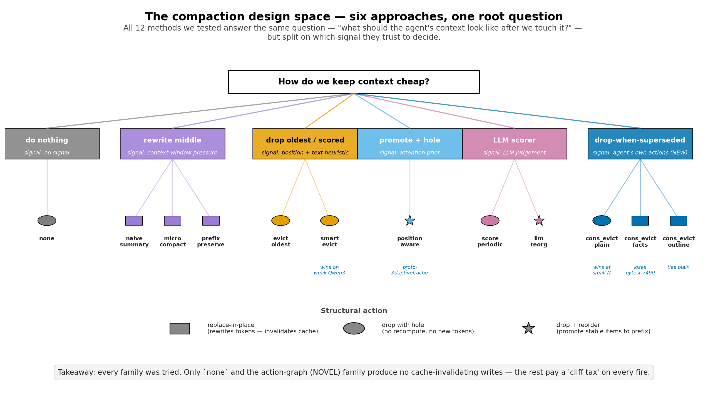

Six approaches, grouped by **what signal they trust** to decide which context items to compact. Two structural actions cost extra cache writes (replace-in-place ▢, drop+reorder ★); one is free (drop with hole ◯).

The mechanism finding from this project: **only `none` and the action-graph family avoid cache-invalidating writes**. Every other family pays a "cliff tax" — uncached re-billing of everything past the modified position — on every compaction event.

---

## Family 1 — Baseline (no compaction)

### `none` — keep everything

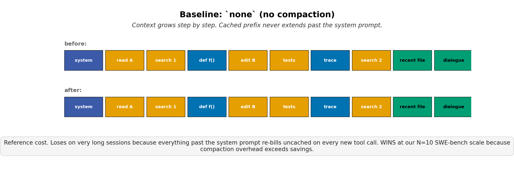

Reference behavior. Nothing is dropped, nothing is rewritten. Every step's input grows by the size of the previous tool observation, but the prefix cache covers everything before the *new* observation. **Wins at our N=10 SWE-bench Lite scale** because compaction overhead exceeds what it saves; loses on very long sessions where the tail accumulates.

---

## Family 2 — Summarize (rewrite the middle in place)

These methods replace context with LLM-written summaries. **Every fire writes brand-new tokens that nothing has cached** — that's the cliff tax in its purest form.

### `naive_summary` — replace everything with one summary

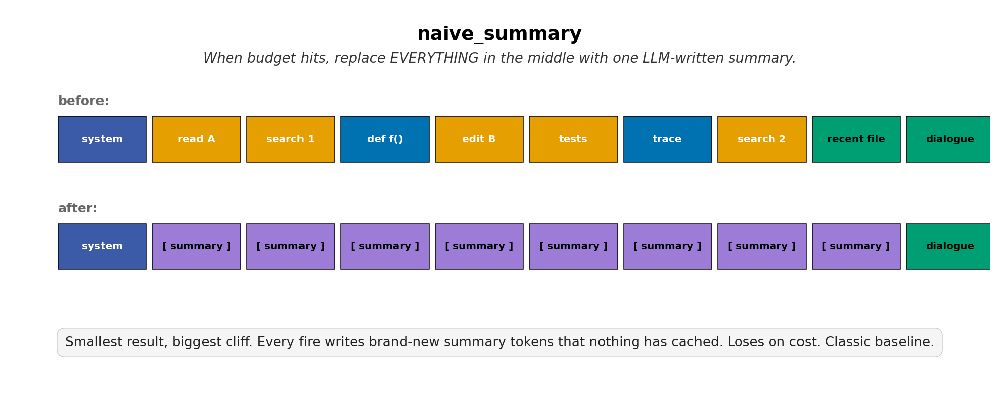

Smallest result, biggest cliff. Classic baseline: when budget is hit, compress the entire middle region into one paragraph. The summary itself is fresh tokens that re-bill uncached, plus everything appended after re-bills uncached too. Loses on cost as soon as it fires once.

### `microcompact` — replace only the biggest item

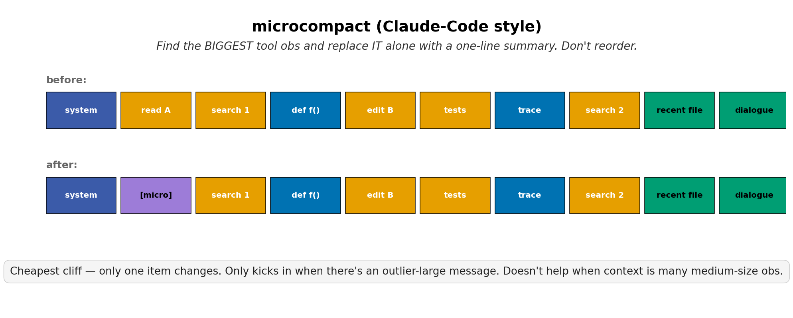

Claude-Code-style: find the single biggest tool observation and replace *it alone* with a one-line summary. Cheapest possible cliff (only one item changes), but only kicks in when there's an outlier-large message — useless when context is many medium-sized observations.

### `prefix_preserving` — keep first-K + summary + recent-K

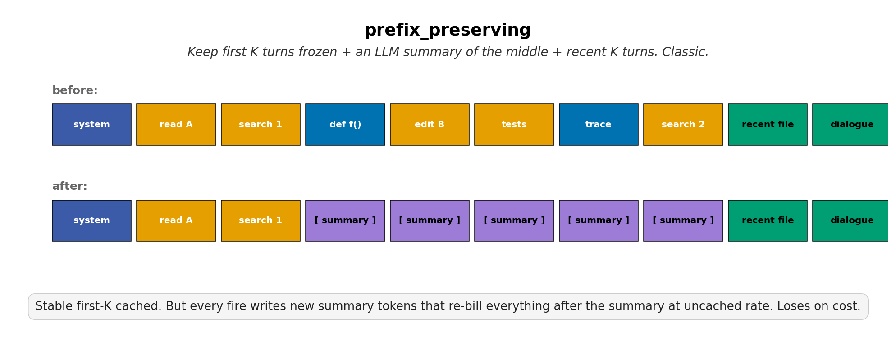

Textbook design: freeze the first K turns (cached forever), summarize the middle, keep the most recent K turns (recency principle). Stable first-K stays cached, but the summary write still invalidates the suffix. Loses on cost.

---

## Family 3 — Heuristic eviction (drop with no rewrite)

These drop items entirely, leaving holes. **No replacement tokens** = no cliff tax on the dropped position itself, but still some prefix-cache invalidation downstream.

### `evict_oldest` — FIFO

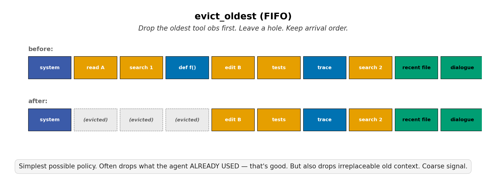

Simplest possible policy. Drop the oldest tool observation, leave a hole, keep arrival order. Often drops what the agent already used (good!) — but also drops irreplaceable old context. Coarse signal.

### `smart_evict` — type prior + reference count

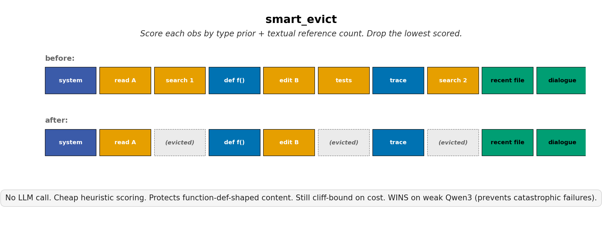

Score each observation by message-type prior + count of textual back-references in later messages. Drop the lowest-scored. No LLM call — pure heuristic. **Wins on weak agents (Qwen3 0.6B–8B)** because it prevents catastrophic context-overflow failures; loses on strong agents because the signal is too coarse.

---

## Family 4 — Reorder (promote stable items to the cached prefix)

The proto-AdaptiveCache idea: don't just drop, *move* important items toward the front so they stay in the cached prefix.

### `position_aware` — pin attention-heavy items, hole-leave the rest

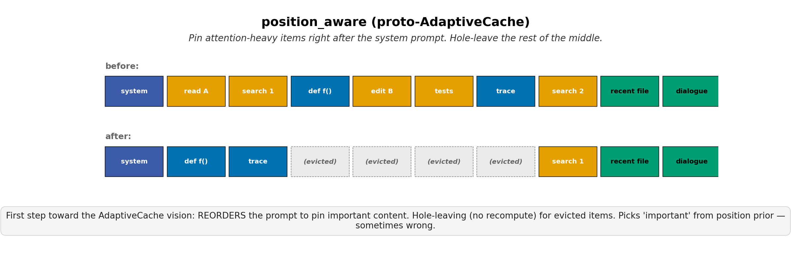

Pin items the agent's attention has been heavy on right after the system prompt; hole-leave the middle. **First step toward the AdaptiveCache vision.** Picks "important" from a position prior — sometimes wrong, but the structural idea (reorder + hole-leave) is the right shape.

---

## Family 5 — LLM-scored compaction

Use a small LLM to score what to keep or reorganize. Adds a quality signal; adds an extra LLM call cost.

### `score_periodic` — periodic LLM scoring

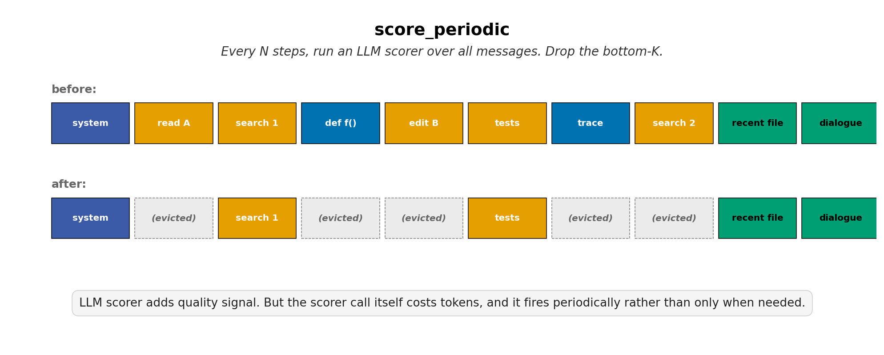

Every N steps, run a small LLM scorer over all messages and drop the bottom-K. The scorer call itself costs tokens, and it fires on a clock rather than on need.

### `llm_reorganizer` — LLM scores + reorders

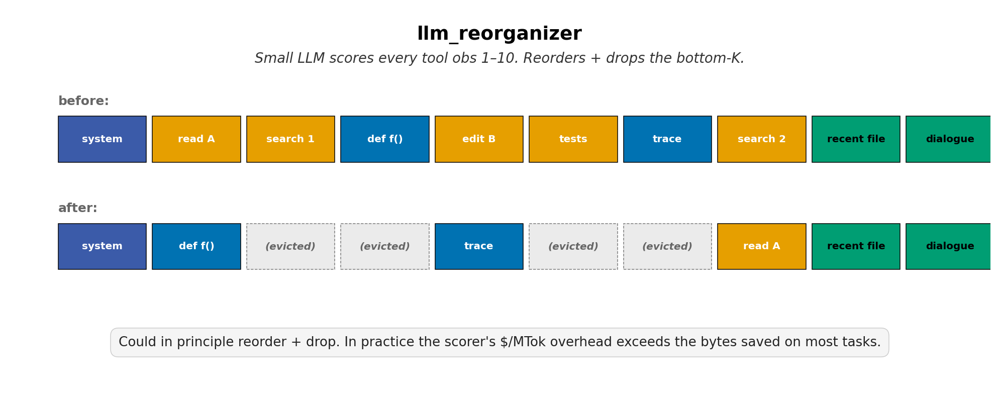

Same idea as `score_periodic` but the LLM is allowed to *reorder* as well as drop. In principle this is what AdaptiveCache should do; in practice the scorer's $/MTok overhead exceeds the bytes saved on most tasks at the scale we tested.

---

## Family 6 — Action-graph supersession (our novel contribution)

Drop only what the agent's **own subsequent tool calls** have made stale. No LLM call, no attention signals — purely structural reasoning over the agent's action graph.

The three variants share the same eviction signal but differ on **what they leave in the placeholder** — and that's the dimension our mechanism finding lives on.

### `consumption_evict` (plain) — minimal placeholder

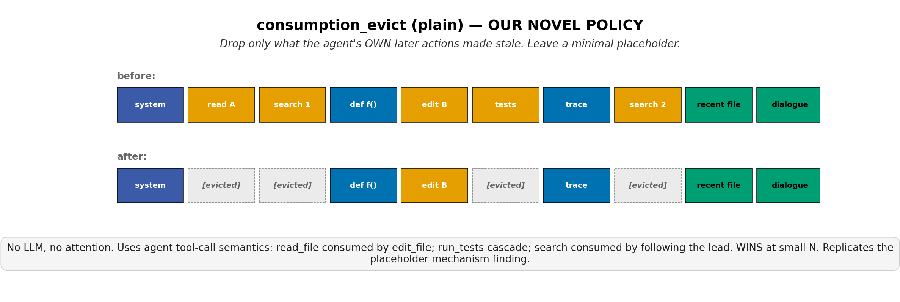

Drop superseded observations, leave a minimal `[evicted]` placeholder. **Wins at small N**: the placeholder is uninformative enough that the agent re-fetches when it needs the content again. Replicates the mechanism finding from pytest-7490: less is more.

### `consumption_evict_facts` — losing variant (the cautionary tale)

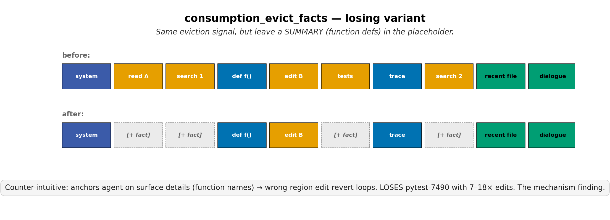

Same eviction signal, but the placeholder summarizes the dropped content's structure (e.g., function signatures). Counter-intuitive result: **anchors the agent on surface details** → wrong-region edit-revert loops. **Loses pytest-7490 with 7–18× more edits.** The headline mechanism finding of the project.

### `consumption_evict_outline` — middle ground

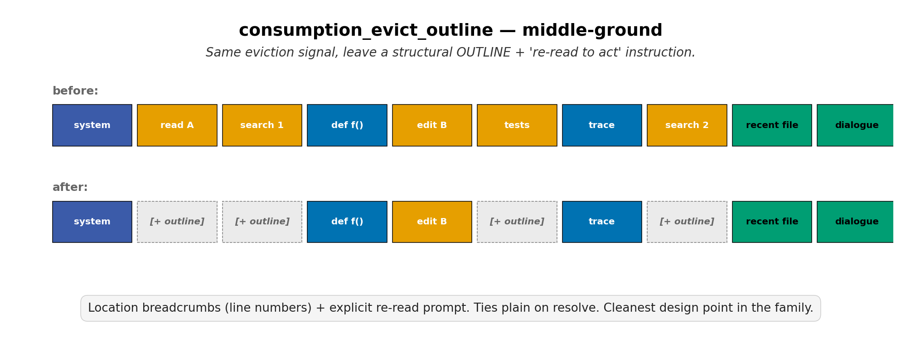

Same eviction signal, leave a structural **outline** (line-numbered headers) plus an explicit "re-read to act" instruction. Location breadcrumbs without anchoring on content. Ties `plain` on resolve rate — the cleanest design point in the family.

---

## How to read the strips

Every method figure shows the same canonical 10-item context:

| Color | Meaning |
|---|---|
|  blue | System prompt (always cached) |
|  dark blue | Stable / high-importance content (function defs, traces) |
|  green | Recent / source-of-truth (kept by all policies) |
|  orange | Tool observations (candidates for compaction) |
|  gray, dashed | Hole — item dropped, no recompute |
|  purple | LLM-written summary (cliff-tax cost) |

---

## See also

- `REPORT.md` — full project writeup with empirical results
- `TALK_5MIN.md` — 5-minute story-mode talk for general audiences
- `figures/fig8_vision.png` — AdaptiveCache vision: layout-aware compaction
- `figures/fig5_cliff_amplification.png` — why summarize-family loses (10× cliff tax)
- `figures/fig3_placeholder_ablation.png` — the pytest-7490 mechanism HERO figure
