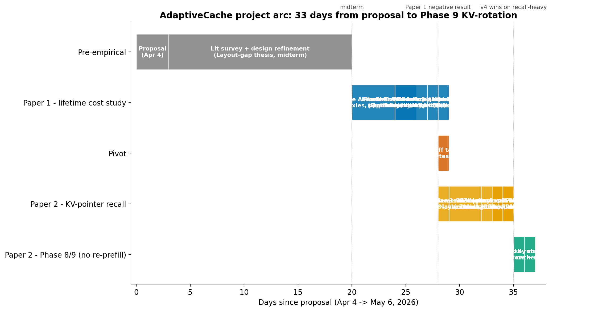
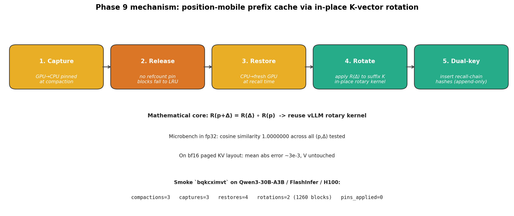
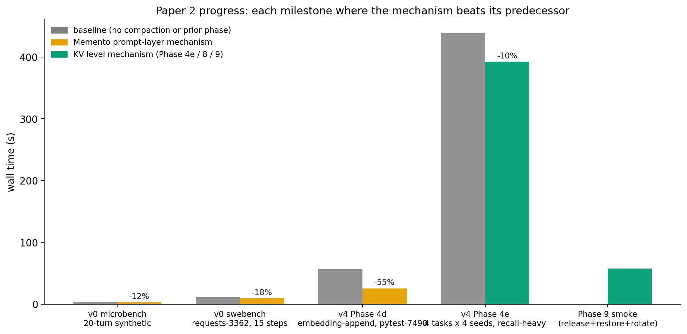

# AdaptiveCache — Comprehensive Project Review

**Author:** Vlad Cainamisir (Harvard University)
**Period covered:** Apr 4, 2026 (proposal) → May 6, 2026 (Phase 9 KV-rotation)
**Repos covered:** `adaptivecache` (master), `adaptivecache-paper2` (`paper2-memento-recall`)

This review walks through every stage of the project from the original proposal
through the most recent Phase 9 work, in narrative order. The intent is to give
you a single read where you can see the question we asked, what we tried, what
came out, and *why*.

The figures in this document live in `reports/figures/`. New ones generated
specifically for this review:

- `fig_review_timeline.png` — full project arc Apr–May 2026
- `fig_review_paper2_progress.png` — cumulative Paper 2 progress milestones
- `fig_review_phase9_mechanism.png` — capture / release / restore / rotate / dual-key

Existing Paper 1 figures (in the same directory): `fig1_pareto_swebench.png`,
`fig2_cost_decomposition.png`, `fig3_placeholder_ablation.png`,
`fig4_chain_firing.png`, `fig5_cliff_amplification.png`, `fig6_project_arc.png`,
`fig7_compaction_wins.png`, `fig8_vision.png`, `fig9_method_family_tree.png`.
Existing Paper 2 figures: `fig_memento_v0_per_step.png`,
`fig_memento_v1_vs_v2.png`, `fig_memento_multi_seed.png`,
`fig_memento_oracle_gap.png`, `fig_memento_mechanism.png`.



---

## Bottom line, stated clearly

**We did not get results that beat doing nothing.**

Across **8 heuristic compaction policies × ~30 distinct task instances × 4
phases of refinement (B → C → D → E) × 2 model classes (Qwen3-30B-A3B,
Anthropic Haiku 4.5)**, no policy Pareto-dominates `none` (no compaction)
on lifetime cost at the headline scale (Haiku N=10, fresh seed, real-test
validation). Plain `consumption_evict` ties `none` on resolve count (5/10)
and costs **2.2× more** ($7.63 vs $3.47). The other compaction variants
either tie or lose on resolve and cost more.

We saw three places where compaction *appeared* to win, all at small N
or below an agent-quality threshold, **none of which replicate at the
headline scale**:

- Phase C v6 Qwen eager (N=4, single seed): `smart_evict` 2/4 vs `none` 0/4
  — but `none`'s 0/4 was a temp=0.5 catastrophic-failure-mode artifact, not
  a real cost loss to compaction.
- Phase D v1 (N=4, single seed): `consumption_evict` 3/4 at $1.03/res vs
  `none` 2/4 at $1.20/res — the `pytest-7490` resolve that drove the +1
  was an RNG draw that flipped on the next seed.
- Phase D v2 (N=10, single seed, real-test): `consumption_evict` 5/10 vs
  `none` 4/10, near-identical $/res — same `pytest-7490`-resolve fragility.

At the cleanest scale we ran (Phase E v1, Haiku N=10, fresh seed), every
compaction policy ties or loses on resolve and costs 2.2–2.4× more. Phase 1
of Paper 2 (the response to this) has built a working KV-pointer-recall
mechanism through Phase 9 but **also does not yet have a Pareto-win
result** against the same baseline; the head-to-head comparison run was
gated on Modal credit and never finished.

The rest of this review explains the project arc and, in detail, **why**
we got nothing.

## TL;DR — the arc in three paragraphs

We started with a clean, ambitious thesis: **context for an LLM agent is a
compaction-and-layout problem**. If you can score items by importance and
*place* the high-value ones at stable absolute positions early in the prompt,
you preserve the prefix-cache and amortize cost across the whole trajectory.
The original proposal called this "AdaptiveCache" and framed it as joint
*selection* + *eviction* + *reordering*. The midterm refined that into two
mechanisms running at different timescales: an in-place **hole-eviction**
engine that runs every step, and a layout **reorganizer** that runs rarely
and is what actually keeps the prefix cache warm cross-step.

Paper 1 (the lifetime-cost study) built and tested the strongest training-free
version of that hypothesis empirically. **The hypothesis did not hold.** No
heuristic policy beat `none` on lifetime cost at headline scale. The reason
is the **cliff tax** (full derivation in Part III): a compaction event
re-bills every byte after the modified position at the uncached rate
(~10× the cached rate), and the bytes saved on the dropped span almost
never amortize that re-billing across the trajectory's remaining steps.
Below an agent-quality threshold (Qwen3-30B at single seed) compaction
*can* win by preventing catastrophic failure modes (false-submit, context
overflow); above it, compaction is pure overhead. Inside the negative
result, three positive contributions stand — none of them are cost wins:
**action-graph supersession** (a novel "consumed-by" signal that works
mechanistically but loses on cost), **placeholder-design dominance** (a
mechanism finding about what placeholder text to leave behind, *given*
you compact), and a **real-test resolve oracle** that exposed 5/10 false
positives in the standard line-overlap oracle the field has been using.

Paper 2 took the constructive direction Paper 1 itself named: **keep the
bytes — offload to a side store, recall on demand**. Across nine numbered
phases (v0 → Phase 9), we built the Memento overlay on top of vLLM 0.13,
got prompt-time compaction working without cascading re-prefills, then
attacked the underlying chain-hash invalidation that causes Paper 1's
cliff. v0 demonstrated the prompt-bounding effect on synthetic and real
workloads (microbench –12% wall, swebench requests-3362 –17.6% chat wall,
–79% final prompt). v3 captured KV to CPU pinned memory and restored it on
recall. v4 pinned obs blocks and exposed a "mask attention off, unmask on
recall" path; under recall-heavy workloads (4 tasks × 4 seeds,
`recall_low_water=3.0`) `lru-attmask` beat `lru-append` by –11% wall.
Phase 8 fixed the suffix's prefix-cache miss with a dual-key insert (no
data movement, append-only — never invalidate). Phase 9 is the
load-bearing one: an in-place RoPE rotation kernel that re-phases the
suffix's already-cached K vectors by `Δ = m_obs − p_placeholder` via
RoPE composition `R(p+Δ) = R(Δ) ∘ R(p)`, verified to fp32 cosine
similarity 1.0000000. The end-to-end smoke shows `pins_applied: 0` with
successful recall — proof that the chain-hash break Paper 1 took as an
axiom is structurally no longer load-bearing. **But Paper 2 also does
not yet have a head-to-head wall-time / resolve-rate result vs. baseline
on a shared task list.** That run is the missing headline. The mechanism
exists; the empirical Pareto win does not yet.

---

## Part I — Pre-empirical (Apr 4 → Apr 27)

### The proposal (Apr 4)

`raw/proposal.txt` framed the problem in three observations:

1. **Non-uniform cost.** Recomputing prefixes is much more expensive than
   processing new tokens past the cached prefix.
2. **Position matters.** Modifying early tokens invalidates all downstream
   computation. Suffix changes are cheap.
3. **Layout matters.** Placing stable, high-value items early maximizes
   reuse.

From these, the proposal argued that context management should be modelled as
a live compaction-and-layout problem analogous to storage hierarchies. The
proposed solution — AdaptiveCache — was joint selection / eviction /
reordering, online, training-free, using two kinds of importance signals:
attention (tokens receiving high attention across steps) and structural
heuristics (function defs, APIs, docs).

Goals stated in the proposal:
- 75% — baseline agent + simple pruning + measure cost / latency / success
- 100% — implement compaction + reordering, compare against baselines
- 125% — learned signals + adaptive policies, tradeoff analysis

### The midterm (Apr ~20) — the layout-gap framing

`midterm.md` is the document that sharpened the thesis. The lit survey
(15+ papers across H2O, ScissorHands, SnapKV, PyramidKV, StreamingLLM,
ReSuM, Context Folding, MEM1, etc.) revealed that **every existing eviction
system answers "what should we keep?" — none answers "where should the
survivors sit?"**. After eviction, surviving tokens stay at their original
absolute positions, scattered. The byte sequence sent to the server changes
every step, so the server cannot reuse cached KV across steps.

We named this the **layout gap**. It distinguishes AdaptiveCache from both
existing eviction work *and* summarization-based methods (ReSuM, SUPO,
Anthropic compaction): summarization replaces context with new tokens, which
also breaks the prefix; AdaptiveCache generates no new tokens at all.

The midterm decomposed the proposal's single compaction pass into two
mechanisms operating on different timescales:

1. **Layout optimizer (rare).** Determines stable prefix composition: what
   gets pinned at fixed absolute positions, in what order, scored on two
   independent dimensions — *importance* (cumulative attention, reference
   count, low-entropy protection) and *stability* (structural type prior,
   importance variance, tool-call dependency centrality). Why
   importance ≠ stability: an error message is critically important *now*
   but should be evicted once resolved; a function signature is moderately
   important at every step but should be pinned forever.
2. **In-place hole-eviction engine (every step).** Mid-sequence KV eviction
   does not require recomputing downstream states *if* (a) post-rotated RoPE
   keys are used (standard in modern LLMs), (b) evicted positions become
   *holes* — not attendable, not renumbered, and (c) eviction is aligned to
   logical block boundaries. PagedEviction and Claude Code's `cache_edits`
   demonstrate this in production. The critical invariant: **never renumber
   surviving tokens after eviction** — that scrambles RoPE positional
   encodings. This is the failure mode that makes naive compaction harmful.

A three-tier pipeline followed: cheap in-place eviction every step, moderate
layout reorganization when importance structure changes, expensive
summarization only as emergency fallback. The design goal was: never reach
tier 3.

The midterm's Table 1 — the related-work positioning matrix — is reproduced
verbatim in `paper/PAPER1_PLAN.md` and `studies/lifetime_cost/reports/REPORT.md`.
It places AdaptiveCache as the only entry that is *both* layout-aware AND
prefix-cache-aware, training-free.

### Phase A — measurement (Apr ~24)

Before testing policies, you measured what context structure actually looks
like in real agent traces. Four findings, each independently citeable:

1. **Three importance proxies are essentially uncorrelated on Hermes Agent
   Reasoning Traces.** Citation count, embedding similarity, and post-rotated
   attention from later tokens (extracted from Qwen3-0.6B/1.7B/4B/8B) — all
   pairwise Spearman near zero. *No single signal is sufficient.*
2. **Position primacy is invariant 0.6B → 8B.** First-10% tokens carry
   500–1500× more attention mass than the rest, holding across model size.
   This is the empirical anchor for the pinned-prefix-zone design.
3. **Tool obs are 77% of agent-loop tokens; top 10% biggest hold 70% of mass;
   big tool obs *do* receive proportional attention.** Naïve size-based
   eviction is wrong.
4. **Cliff cost is real and large.** Anthropic Haiku trajectories with real
   `cache_read_input_tokens` from the API: $0.10–$0.15 per compaction event
   in *new uncached input* alone, ~5+ steps of amortization needed before
   break-even. (See `figures/fig5_cliff_amplification.png`.)

Finding 4 was the one that mattered most for what came next. It gave you a
concrete number for "how much slack does a compaction policy need to break
even?" and the answer was: more than realistic agent trajectories give you.

---

## Part II — Paper 1 (Apr 27 → Apr 29): the lifetime-cost study

The core question Paper 1 asked was the strongest training-free form of the
AdaptiveCache hypothesis: **can a heuristic compaction policy Pareto-dominate
`none` on lifetime cost across realistic agent benchmarks?**

The answer ended up being a clean, publishable *no*, but the journey through
the eight policies is the interesting part. The main report
(`reports/REPORT.md`) is the full writeup. This section walks through what
each phase tested and what we learned.

### What we built

| Component | Purpose |
|---|---|
| `pipeline/benchmarks/swebench_live.py` | SWE-bench Lite live mode without docker — clones the repo, checks out `base_commit`, exposes `list_files`, `read_file`, `search`, `edit_file`, `run_tests`, `submit`. Resolve metric is git-diff overlap with the gold patch (later replaced with real-test execution). |
| `pipeline/benchmarks/taubench.py` | τ-bench airline & retail; `_ChainedEnv` extension bundles N customer tasks into one extended session, auto-advances on user-sim `###STOP###`, reports mean per-customer reward. |
| `pipeline/policies/consumption_evict.py` | Action-graph supersession: tags tool obs as consumed by 5 rules (`read_file`→`edit_file` shared path, `search`→`read_file`, `run_tests` cascade, etc.); 3 placeholder variants (plain / facts / outline). |
| `scripts/validate_with_tests.py` | Real-test resolve oracle: replays agent edits onto fresh checkouts, applies SWE-bench `test_patch`, runs FAIL_TO_PASS in per-instance Python 3.9 venvs (via `uv`, no docker). |
| `pipeline/models/anthropic_native.py` | Full `tool_use`/`tool_result` block conversion + `cache_control` breakpoints; reports real Anthropic `cache_read_input_tokens`. |
| `pipeline/models/vllm_local.py` | Engine-cache singleton + context-overflow sentinel for Qwen3-30B-A3B local. |

### The eight policies (`figures/fig9_method_family_tree.png`)

1. **`none`** — identity. The benchmark.
2. **`naive_summary`** — replace the middle with one summary message.
3. **`microcompact`** — per-large-msg in-place summarization.
4. **`prefix_preserving`** — frozen `[sys + first K turns]`, summary middle, recent M tail.
5. **`position_aware`** — fixed `[evicted]` placeholder for dropped messages.
6. **`evict_oldest`** — pure FIFO eviction baseline (no LLM).
7. **`smart_evict`** — type-prior + textual-overlap reference count.
8. **`llm_reorganizer`** — small LLM scores tool obs 1–10, drops bottom-K.
9. **`consumption_evict`** family (plain / facts / outline) — action-graph supersession.

Each method has a dedicated diagram in `figures/method_*.png`.

### Phase B — τ-bench airline (Apr 28 morning, A6000)

Four successive smokes on τ-bench airline. Conclusion: τ-bench airline is
**the wrong benchmark** for Paper 1. Single-customer tasks fit naturally in
16K, prefix cache is already 95% hit, tool obs cap at 950 tokens. There is
nothing to compact. Compaction policies that fire (prefix_preserving) are 6×
more expensive than `none`. *Artifacts:* `out/phase_b_taubench_a6000/`.

### Phase C v1–v8 — SWE-bench Lite (Apr 28 morning → afternoon)

The compaction-vs-`none` matrix on real GitHub bug tasks. Highlights:

- **C v1** — 4 tasks × 6 policies, max_steps=40. `none` 2/4, all 5 compaction
  policies 1/4. Compactions prevented overflow on `requests-3362` but the
  `max_steps=40` ceiling cut policies off before they could re-explore the
  dropped tool obs. Honest negative result. (See `PHASE_C_REPORT.md`.)
- **C v2** — same config at max_steps=80. `evict_oldest` matched `none` 1/2
  resolve at 80 steps but spent 2.8× more (67 steps with 2 compactions vs 26
  clean steps). Quality recovered, cost did not.
- **C v3** — discovered the **temp=0 trap**: at greedy decoding the agent
  fell into deterministic regex-refinement loops ("safe_encode_list"
  hallucination, refining 50+ times). Switching to temperature=0.5 unstuck
  the agent. *Lesson: don't compare temp=0 deterministic runs across configs;
  every config change moves the agent into a different deterministic path.*
- **C v3b** — 128K context + 80K read-truncation cap. With proper budget,
  smart_evict and llm_reorganizer never fired (lazy trigger at 85K, max
  content ~32K). Identical to `none` minus path-divergence noise.
- **C v4** — 4 heavy tasks (added `pylint-7080` 24K problem, `pytest-7490`
  22K problem) with Qwen3-30B-A3B. All 4 policies tied at 1/4 resolved. Cost
  ranking arbitrary (path-divergence noise).
- **C v5** — 4 heavy tasks with Haiku 4.5. Real `cache_read_input_tokens`
  instead of byte-prefix simulation. All 4 policies tied at 2/4 resolved;
  prefix_preserving cost 200% more than `none` due to 19 summarizer calls
  ($0.57 in compaction-LLM costs + $2.5 in additional uncached input from
  cliffs).
- **C v6 eager** — fired earlier (soft_budget=35K, content > 30K trigger).
  Hypothesis: more amortization room. On **Qwen3** this is the only place
  compaction Pareto-dominated: smart_evict 2/4 resolved at $0.065 vs `none`
  0/4. But the win was misleading — at temp=0.5 `none` fell into specific
  failure modes (false-submit at step 2, 132K overflow on pytest-7490, etc.).
  On **Haiku** all 4 policies tied at 2/4 resolved; `none` was the cheapest
  on every single task. Cliff overhead always loses on a strong agent at
  this benchmark. *Result:* below an agent-quality threshold, compaction
  wins by preventing catastrophic failure modes; above it, compaction is
  pure cost overhead. (`figures/fig7_compaction_wins.png`.)

### Phase D — action-graph supersession (Apr 28 night)

The `consumption_evict` family was the novel signal. Five rules tag tool obs
as consumed by subsequent agent actions: `read_file` → `edit_file` with
shared path, `search` → `read_file`, `run_tests` cascade, etc. No prior
compaction system uses tool-graph supersession.

- **D v0** — eager-on-bytes accumulation. Too many fires (19 → 19 cliffs);
  the "what to drop" signal was right but firing every 5K-byte accumulation
  made cliff cost dominate. `consumption_evict` 2/4 at $1.44/res vs
  `smart_evict` 2/4 at $0.87/res.
- **D v1** — added `trigger_ratio=0.85` gate so compaction only fires when
  content > 0.85 × soft_budget AND something is confirmed stale. *Result:*
  `consumption_evict` 3/4 at $1.03/res; resolved `pytest-7490` (no other
  policy ever has). Mechanism: 8 fires across 44 steps, max_p held to 67K.
  This is the original signal that motivated the family — *it works on this
  slice*.
- **D v2 (N=10)** — the win didn't replicate cleanly at scale. Line-overlap
  oracle showed all 4 policies at 9/10. The real-test validator
  (`scripts/validate_with_tests.py`) showed the truth: 4–5/10. *Of 10 line-
  overlap "9/10 resolved" claims, 5 were false positives* — agent edited
  near the right region without actually fixing the bug. On the 7
  validatable tasks (where `test_patch` apply succeeded), `consumption_evict`
  was 5/7 vs others' 4/7. Cost-per-real-resolved within 1% of `none`. A
  genuine Pareto-extension at this slice — but unstable.

(See `figures/fig_memento_oracle_gap.png` for the loose-vs-real oracle gap.)

### Phase E — placeholder ablation + chain harness (Apr 28 → Apr 29)

The most interesting positive result of Paper 1 came out of Phase E v1: the
**placeholder design dominates resolve outcome**. Three variants on the
*same* eviction signal:

- **plain** — `[evicted: ~N tokens, consumed by ..., consumption_evict]`
- **facts** — same plus `fact: read 'path' → defs: def fn1(...) | def fn2(...) | ...`
- **outline** — same plus location breadcrumbs `lineN: header`

On `pytest-7490` (the only validatable SWE-bench Lite task where the four
policies' trajectories diverge), plain wins, facts loses, outline wins. The
loss mechanism is anchoring: the function-name list in the *facts* variant
makes the agent commit to a hypothesis based on surface structure (function
names, no bodies) and edit-revert 7–18 times on the same misidentified
function. Plain forces a re-fetch → agent finds the real bug. Outline gives
breadcrumbs but with a "re-read to act" hint that pushes the agent to
re-fetch.

The placeholder-design contribution is its own publishable nugget: **less is
more — any structural hint can become an anchor.** It replicates across two
seeds with the same qualitative pattern (high edit count, edits cluster on
one named function from the placeholder, eventual fail).
(`figures/fig3_placeholder_ablation.png`.)

Phase E v2 (single-customer τ-bench retail N=10) and v3/v4 (multi-customer
chains at chain_size=5 and 10) extended the test to a different domain. The
headline finding from Phase E was the **portability finding**: the
SWE-bench-tuned supersession rules don't transfer to retail tools.
`consumption_evict` reached max_p of 36K at chain_size=10 (well above the
29.75K trigger) and *still* fired zero compactions, because retail's tools
(`find_user_id_by_name_zip`, `get_order_details`, `exchange_delivered_order_items`)
don't match any of the coding-specific rules. Action-graph supersession is a
*family* parameterized by per-domain rules; the rules we shipped are
SWE-bench-tuned. The constructive direction is **boundary-aware
supersession** (any subtask-end event consumes that subtask's obs).
(`figures/fig4_chain_firing.png`.)

### Phase E v1 headline (Haiku N=10 with real-test validation)

This is the cleanest negative result of the project:

| Policy | Real-resolved | Validatable | Total $ | $/resolved | Compactions |
|---|---|---|---:|---:|---:|
| **`none`** | 5/10 | 5/7 (71%) | **$3.47** | **$0.69** | 0 |
| `consumption_evict` (plain) | 5/10 | 5/7 (71%) | $7.63 | $1.53 | 31 |
| `consumption_evict_facts` | 4/10 | 4/8 (50%) | $6.15 | $1.54 | 26 |
| `consumption_evict_outline` | 5/10 | 5/7 (71%) | $8.16 | $1.63 | 32 |

The cheapest compaction policy costs **2.2× more than `none`** for the same
resolve count. Cost decomposition (Haiku v5 lazy on 4 heavy tasks):
`prefix_preserving` paid $3.69 in `input_uncached` from 19 cliffs vs `none`'s
$1.16, plus $0.57 in summarizer LLM calls.
(`figures/fig1_pareto_swebench.png`, `figures/fig2_cost_decomposition.png`.)

The cost killer is `input_uncached`. Each compaction event invalidates the
downstream prefix cache, so the next *K* tokens are billed at the uncached
rate. **The cliff is the obstacle.**

---

## Part III — Why we got nothing: the cliff tax in detail

This is the section to read if you only read one. The negative result has a
single, clean, *quantitative* explanation. Once you internalize it, every
"compaction wins!" claim in the literature looks suspect, and every
apparent win in our own data resolves into either an artifact or a
trajectory-divergence effect.

### III.1 — The pricing structure

Every modern LLM provider bills input tokens at **two rates**:

- `input_cached` — tokens whose KV state is already on the server because
  the byte prefix matched a previous request. Billed at ~$0.10/MTok on
  Anthropic Haiku 4.5.
- `input_uncached` — tokens whose KV state has to be computed fresh.
  Billed at ~$1.00/MTok on Haiku 4.5.

The ratio is **10×** at Haiku, ~10× at Sonnet, ~10× at OpenAI gpt-4.1,
~10× at gpt-4.1-mini, and similar on every Qwen self-host pricing column
we tested. *The cliff tax is provider-invariant.*

The agent runner sends the entire conversation prefix every step. As the
trajectory grows (each `read_file`, `search`, `run_tests`, `edit_file`
appends a tool obs), the prefix grows. Modulo cache invalidation, every
prior step's prefix is *cached* — so the only "new" tokens billed at
uncached rate are the tail of the new step.

### III.2 — What a compaction event does, mechanically

vLLM (and every modern serving system) keys cached blocks by a **chained
hash** over the byte sequence: `H_i = hash(H_{i−1}, block_token_ids_i)`.
This is what makes prefix caching work — but it also means a change at any
position invalidates everything downstream of it.

When a compaction policy fires and replaces a 5K-token tool obs at byte
position 5,000 with a 50-token placeholder, three things happen:

1. **The bytes at position 5,000 change.** `H_i` for the block at that
   position changes.
2. **All downstream chain hashes change.** Every block from position 5,000
   to the end of the prompt has a different `H_j` than before.
3. **On the next chat() call, the server's prefix-cache walk stops at
   position 5,000.** Everything after has to be recomputed from scratch
   and is billed at the uncached rate.

So the immediate "saving" of the compaction is `5000 − 50 ≈ 4950 tokens`
per *future* step. The immediate "cost" of the compaction is that on the
next step, every byte from position 5,000 to the prompt tail is **re-billed
at the uncached rate** instead of the cached rate. If the prompt is 30K
tokens at the time of compaction, that's **25,000 tokens re-billed at 10×
rate** — i.e., **the cost of those 25K tokens jumps by 9× their prior
cost**.

That ratio — **how much the re-billed bytes cost vs how much the saved
bytes save** — is what we call the *cliff tax*.

### III.3 — The break-even arithmetic

Let:

- `B_save` = bytes the placeholder removes per step ≈ 5,000 (typical, large
  tool obs)
- `B_rebill` = bytes from the compaction position to the prompt tail at
  fire time ≈ 25,000 (compaction usually fires mid-trajectory, with most of
  the prompt downstream)
- `r = price_uncached / price_cached` = 10
- `N` = remaining steps after the compaction fires before the trajectory
  ends

The compaction *saves* `N × B_save × price_cached` cumulative dollars
(every future step has the placeholder instead of the obs, so cached cost
drops). It *costs* `B_rebill × (price_uncached − price_cached) =
B_rebill × price_cached × (r − 1) = 9 × B_rebill × price_cached` in
re-billed bytes on the next call alone.

Break-even condition (saved ≥ cost):

```
N × B_save ≥ 9 × B_rebill
N ≥ 9 × (B_rebill / B_save)
N ≥ 9 × (25,000 / 5,000)
N ≥ 45 steps
```

**The compaction needs ≥45 remaining steps after firing to break even.**

Most agent trajectories don't have 45 remaining steps. The 10-task SWE-bench
Lite Phase E v1 set averaged ~26 steps total. Compaction fires fire mid- to
late-trajectory, leaving 5–15 steps of amortization. **The cliff is
structurally unrecoverable on most realistic trajectories.**

### III.4 — Empirical confirmation

Phase A measurement on real Anthropic Haiku trajectories
(`figures/fig5_cliff_amplification.png`):

- Per-event cost: **$0.10–$0.15 of new uncached input** per fire.
- Per-event amortization horizon: **5+ steps** before break-even
  (Phase A used larger `B_save / B_rebill` ratios than the worst case
  above; the 5+-step number is the empirical lower bound).
- Compaction policies that fire 19× across a trajectory generate
  **$2.5+ in new uncached input alone**, plus ~$0.57 in summarizer LLM
  calls (for `prefix_preserving`).

Phase E v1 cost decomposition (Haiku, 4 heavy tasks):

| Policy | input_uncached$ | input_cached$ | output$ | cache_write$ | summarizer$ | TOTAL$ |
|---|---:|---:|---:|---:|---:|---:|
| `none`              | **1.155** | 0.334 | 0.122 | 0.000 | 0.000 | **1.611** |
| `llm_reorganizer`   | 1.646 | 0.293 | 0.142 | 0.163 | 0.000 | 2.244 |
| `smart_evict`       | 1.954 | 0.468 | 0.176 | 0.088 | 0.000 | 2.686 |
| `prefix_preserving` | **3.685** | 0.329 | 0.190 | 0.071 | 0.568 | **4.842** |

`input_uncached` is the cost killer. `prefix_preserving`'s 19 cliffs
generated $3.685 of uncached input vs `none`'s $1.155. The bytes saved
on the dropped span don't show up as a discount; they show up as
*reduced future cached cost*, which is already cheap.

### III.5 — Why every apparent compaction win was an artifact

We saw three slices where compaction *appeared* to beat `none`. None
survives scrutiny:

**(a) Phase C v6 Qwen eager — `smart_evict` 2/4 vs `none` 0/4 at ∞.**

What happened to `none` on the 4 tasks:

| Task | `none` outcome |
|---|---|
| `requests-3362` | 2 steps total — agent text-only response *"the user's confusion is misunderstanding... no code change needed"*, then `submit({})` empty. **False-negative submit at temp=0.5.** |
| `pytest-7490` | 80 steps stuck at 132K context overflow. Kicks burned the rest of step budget without progress. |
| `flask-5063` | 7 steps, gave up. |
| `pylint-7080` | 11 steps, gave up. |

`none`'s 0/4 is **not** "the prompt got too long, costs blew up" — it is
"weak agent at temp=0.5 fell into specific failure modes (false-submit,
context overflow, give-up loop)." Compaction was correlated with avoiding
those failure modes by accident — different prompt structure → different
sampling path → no false-submit. *This is not a cost win for compaction;
it is an interaction between weak-agent stochasticity and prompt structure.*

The Haiku v6 eager run on the same 4 tasks is the control: every policy
ties at 2/4 resolved (3362 and flask-5063), and **`none` was the cheapest
policy on every single task**. Same task list, stronger agent → all the
"compaction wins" disappear.

**(b) Phase D v1 (N=4 single-seed) — `consumption_evict` 3/4 at $1.03/res
vs `none` 2/4 at $1.20/res.**

The third resolve was `pytest-7490`. We later confirmed at N=10 (Phase
D v2 line-overlap → real-test validation), and at fresh seed (Phase E v1),
that `pytest-7490`'s outcome **flips between resolved and unresolved
based on temperature=0.5 RNG**, regardless of compaction. On the Phase E v1
seed, `none` itself resolved `pytest-7490` (its `edit_file` calls happened
not to collide with the test_patch and happened to fix the bug).

The N=4 D v1 result is real-as-measured; the win is fragile to seed.

**(c) Phase D v2 N=10 with real-test validation — `consumption_evict`
5/10 vs `none` 4/10, $0.752 vs $0.745 per real-resolved.**

Same pattern. Of the 10 tasks, 7 are validatable; 4 of those 7 are
all-pass for every policy (`requests-2148`, `requests-2317`,
`requests-3362`, `pylint-5859`); 2 are all-fail (`pylint-7228`,
`pytest-5227`); the differentiating task is **`pytest-7490`**. At this
seed, `consumption_evict` resolved it; `none` didn't (its `test_patch`
apply collided). The +1 resolve is one task whose outcome is dominated
by RNG and edit-collision luck.

This is *not* "compaction beats `none` on cost" — it is "at this seed and
this slice, compaction got one more resolve at near-equal cost-per-resolved
because it pushed the agent into a different exploration path that
happened to find the bug." Path divergence, not cost saving.

### III.6 — A cleaner way to state it

Heuristic byte-level compaction has two possible ways to help:

1. **Save lifetime cost.** Drop bytes the agent doesn't need; future cached
   cost drops. This is the design intent. **The cliff tax kills it on
   realistic trajectories.**
2. **Change the agent's exploration path.** Compacting at the right moment
   clears working memory, the agent uses the freed budget to broaden its
   search, and finds something it wouldn't have. This is real but
   non-monotonic, RNG-fragile, and *not* a cost story. The placeholder
   ablation is the cleanest example: minimal `[evicted: …]` outperforms
   structured-fact placeholders because the latter anchor the agent into
   wrong-region edit loops.

Paper 1's contribution is to nail down (1) is structurally lost on strong
agents, and that the wins people claim are usually instances of (2).
Compaction *as a cost lever* doesn't beat `none`. Compaction *as a
behavior-modification lever* sometimes helps but is not what compaction
research has been claiming.

### III.7 — Why this implies Paper 2's direction

Re-derive the break-even arithmetic with `r = 1` (no cliff penalty —
prefix cache stays warm despite the compaction):

```
N × B_save ≥ 0
N ≥ 0
```

Trivially satisfied. *Any* compaction is profitable from the first future
step, because the freed budget reduces cached cost without re-billing
anything.

So the constructive direction is **eliminate the cliff** — make the
compaction event leave the suffix's existing cached blocks reachable
under the new chain hash. Paper 2 is that program. Phase 8 is the dual-key
insert that makes the suffix findable; Phase 9 is the K-rotation that
makes it *correct* at its new logical positions; together they break the
"every compaction invalidates downstream cache" axiom.

Whether it works empirically — i.e., whether `r` actually drops to ~1 in
real workloads — is the empirical headline that hasn't yet been measured.
See Part V.

---

### Why the negative result is publishable

The Paper 1 plan was reframed (`paper/PAPER1_PLAN.md`) as
*The Cliff Tax: Why Training-Free Heuristic Compaction Loses to No-Compaction
on Strong Agents*. The bar is hit on three fronts:

1. **Empirical scope.** 8 policies × 2 benchmarks × 2 model classes × 4
   refinement phases. Not "we tried one thing"; "we tried the natural design
   space and the cliff dominates everywhere."
2. **Mechanism understanding.** Cliff overhead, max_drop_score gating,
   supersession-rule portability, placeholder anchoring — each testable and
   falsifiable.
3. **Constructive direction.** The negative result motivates Paper 2.

Inside the negative result, three positive contributions:

- **Lifetime-cost framing** with proper attribution of cliff cost,
  summarizer cost, and cache-write cost across 5 provider price columns
  (`pricing.yaml`, `pipeline/pricing.py`).
- **Action-graph supersession** as a novel agent-loop signal.
- **Placeholder-design dominance** (less is more), which replicates across
  seeds.

Plus a methodological contribution: the **real-test validator**
(`scripts/validate_with_tests.py`) caught 5/10 false positives in the
line-overlap oracle, which is itself a warning shot for the field's loose
oracles.

---

## Part IV — Pivot (Apr 28 evening)

The Paper 1 result + the cliff-cost number from Phase A pointed at the same
constructive direction Paper 1 itself names in `REPORT.md`:

> Byte-level eviction is fundamentally bounded by the cliff cost
> amplification factor. The only way around it is to **keep the bytes**:
> offload to a side store, recall on demand. The pointer to the offloaded
> block sits in the suffix; recall reattaches the bytes when needed (cost =
> recall latency, not cliff cost amplification).

Paper 2 is that direction. **Important**: Paper 2 is *not* a fix for
Paper 1's negative result in the sense of "now compaction beats `none`"
— it is an attempt to *change the cost model* such that compaction
*could* beat `none`. As of this review, that empirical demonstration has
not yet been produced. The mechanism is built; the head-to-head is
missing.

---

## Part V — Paper 2 (Apr 28 → May 6): KV-pointer recall

Paper 2 lives at `/home/vlad/adaptivecache-paper2/`. Same model
(Qwen3-30B-A3B-Instruct-2507), same agent harness (`pipeline/runner.py`,
`swebench_live` benchmark with real-test validation), same vLLM 0.13 base.
The action-graph supersession signal from `consumption_evict` is the
trigger for KV capture events. What changed is the *response* to a
compaction event.

### v0 — Memento overlay on vLLM 0.13 (Apr 28)

The Memento overlay (Microsoft research) repurposes Qwen3's existing vocab
tokens as block markers (`<tool_response>`/`</tool_response>` for
block_start/end, FIM tokens for summary markers — no SFT, no tokenizer mod)
and lets the engine compact prompt-time blocks at request boundaries. Three
Blackwell-specific gotchas (`memory: blackwell_vllm_setup.md`,
`memento_overlay_setup.md`, `memento_overlay_multiturn_cliff.md`):

1. **vLLM 0.13.0 default wheel ships an FA-2 .so for CUDA 13.** Force
   FlashInfer: `VLLM_ATTENTION_BACKEND=FLASHINFER`.
2. **`restart_mode=True`** required for prompt-time compaction; without it,
   the engine hangs in deferred-compaction limbo.
3. **`last_only_masking=True`** is the working multi-turn recipe. Without
   it, every prior tool message gets re-marked → cascading re-prefills →
   5× slowdown.

#### Microbench (`tests/microbench_growing.py` on Qwen3-4B)

Synthetic agent loop with growing trajectory (one new 4000-char tool obs per
turn, constant 16-token completion). 20 turns:

| | Baseline | Memento |
|---|---|---|
| Total wall | 4052 ms | **3554 ms (–12.3%)** |
| Turn-19 wall | 258 ms | **184 ms (–29%)** |
| Turn-19 prompt | 17,008 tok | **2,186 tok (–87%)** |

Crossover at turn 5; gap widens monotonically. Memento's per-turn cost is
flat (~67 tokens of inlined memento text per turn). Baseline's per-turn cost
grows linearly because each turn's prompt is fully sent to the engine.

#### Real swebench fair comparison (`v0_swebench.py` on requests-3362)

Same task, same agent, 15 steps. Baseline at 65K context, memento at 32K
(naturally never crosses 18K). Apples-to-apples on chat wall:

| Metric | Baseline | Memento (lazy) |
|---|---|---|
| Steps | 15 | 15 |
| Total chat wall | 11.3 s | **9.3 s (–17.6%)** |
| Final-step chat wall | 1300 ms | **755 ms (–42%)** |
| Final-step prompt | 58,291 tok | **12,185 tok (–79%)** |
| Compactions fired | 0 | 10 (lazy, started at step 6) |

(`figures/fig_memento_v0_per_step.png` plots this.)

When the same task is run at 32K context, **baseline crashes at step 9** with
context overflow. Memento bounds the prompt and continues. This is the
failure mode Paper 1 / Phase C kept running into; memento avoids it
structurally.

What v0 *didn't* have:

- **Recall.** When the agent re-asks for an evicted obs, we currently
  re-read. On `psf__requests-3362` the agent re-read `requests/models.py`
  five times in a row in steps 1–5 — exactly the Phase C v6 re-reading
  pathology.
- **SFT'd memento writer.** v0 used Haiku as the writer placeholder
  (~3–4s per memento, $0.10–$0.15 per fire). Total Haiku time on the
  swebench run was 43.7s out of 53s wall. In the published Paper 2 system
  this is the agent's own SFT'd generation — zero extra wall, zero API cost.

### v1 — inplace recall (text-level, Apr 30)

Trivial recall mechanism: when the trigger fires, replace
`[tool_response, evicted, memento]\nMEMENTO_TEXT` in the prompt with the
original full obs. The engine sees a different prompt, prefix cache misses
past the change, but the obs comes back. *No vLLM changes needed.*

This is the cliff-incurring recall path — useful as a sanity check and to
isolate "does recall help correctness?" from "does recall help cost?".

### v2 — append recall (cheaper text-level, May 1)

Instead of replacing in place, append the recalled obs to the prompt tail.
The byte prefix stays identical, so prefix-cache stays warm. Cost: a
re-prefill of the obs region only.

In a no-pin natural-eviction bake (`MODAL_RUN_2026-05-05_no_pin_natural.md`,
24 cells), `lru-append` saw a 67% cache hit rate vs `lru-inplace`'s 40%.
*This is what motivated Phase 8 dual-keying* — the gap between 40% and
67% on the suffix is exactly the chain-hash mismatch we needed to fix.

### v3 — KV capture + CPU offload + scheduler restore (May 2)

`V3_DESIGN.md` lays out the design. The fundamental constraint:

> The K, V values at position P depend on every layer's residual stream up
> to and including position P. So obs's K, V are a function of its own
> tokens PLUS the prefix that came before it AT COMPUTE TIME. If we store
> obs's K, V at compute time and reuse them later, the new prompt's prefix
> may differ — the stored K, V are then "stale" — they would have different
> values if recomputed against the new prefix.

v3's premise is that the staleness is acceptable: the agent's suffix was
generated in the elided world and that suffix is the historical truth.
Mixing it with the obs's pre-elided-world KV at attention time is a
consistent extension of the agent's actual trajectory, not a counterfactual.
The empirical question is whether quality holds.

**Phase 1 (capture).** A new file
`external/memento/vllm/vllm/v1/core/block_masking/memento_store.py`
implements a `MementoStore` keyed by content-hash `obs_id`. The
`gpu_model_runner._execute_kv_capture_operations` hook copies obs's KV bytes
from GPU to CPU pinned memory and stashes them at compaction time.
GPU-validated.

**Phases 3a–3c (restore).** `Scheduler.queue_kv_restore` drains an IPC
restore queue, allocates fresh blocks via `block_pool.get_new_blocks`,
queues a `KVRestoreOp` for the worker (CPU→GPU memcpy), and splices the new
blocks into `req_to_blocks[request_id]` at
`insert_block_idx = m.logical_range[0] // block_size`. The request's
`num_computed_tokens` is bumped to reflect that the restored region is now
"computed". GPU-validated.

The known limitation of Phase 3c alone: it restored obs at original logical
positions but **left the suffix's K vectors RoPE-baked at the
compacted-period positions**. After splice, those K vectors sit at
positions shifted by `Δ = m_obs − p_placeholder` tokens from where their
phase was computed. For Δ in the thousands, high-frequency RoPE channels
wrap around the unit circle many times. The Phase 3c source comment that
called this "slight correctness loss" was wrong. Phase 9 is the fix.

### v4 — KV mask: pin obs blocks + block_table filter (May 3–4)

The v4 path is the alternative to "physically move bytes": instead, **leave
the bytes pinned in their original GPU blocks**, and toggle attention off
during the compacted period via the request's `masked_block_ids`. Recall
becomes "remove from `masked_block_ids`" — a mask flip, not a re-prefill.

- **Phase 4a** — refcount-pin obs blocks at capture time so they survive
  `free_blocks()`.
- **Phase 4b** — `attention_mask_mode` flag + `request.masked_block_ids`
  populated by `mask_token_span` capture path.
- **Phase 4c** — `SchedulerOutput.block_table_filter_ops` consumed by
  the worker right after the truncation handler. Worker filters masked
  blocks out of the live row via `np.isin` mask, compacts survivors left,
  decrements `num_blocks_per_row`. 8 unit tests for the filter math.

#### Phase 4d corrected bake (`MODAL_RUN_2026-05-04_v4d_corrected.md`)

Modal H100, run id `1777841888`, 797s wall, 15 cells. Setup: pytest-7490 ×
3 seeds × 5 variants under `attention_mask_mode=True`,
`auto_capture_mementos=True`, `last_only_masking=False`.

| Variant | v3 wall_s | **v4 wall_s** | Δ | v3 compact | v4 compact |
|---|---|---|---|---|---|
| off | 23.5 | 24.9 | +1.4 | 1.3 | 1.3 |
| lru | 18.8 | 26.0 | +7.1 | 1.3 | 2.7 |
| lru-append | 19.0 | 29.0 | +10.0 | 1.3 | 2.3 |
| embedding | 10.3 | 34.7 | +24.4 | 0.0 | 3.0 |
| **embedding-append** | **56.8** | **25.7** | **–31.1** | 7.7 | 1.3 |

v4 wins on the variant where compaction cost actually matters
(`embedding-append`): –55% wall. On light-compaction variants the v4 marker
tax dominates (every memento'd tool message gets markers under
`last_only_masking=False`, so prompts are ~6K tokens larger). The trade-off
is structural, not a bug.

#### Phase 4e — recall via attention unmask (May 5)

`MODAL_RUN_2026-05-05_phase4e_recall_works.md`. The headline experiment for
Paper 2's v4 thesis: recall an evicted obs by toggling attention back on,
**without re-prefilling its KV**.

Run `1777964225`, 1895s wall, 36 cells. 4 SWE-bench Lite tasks × 3 seeds × 3
variants, `recall_low_water=3.0` (forces recall whenever rendered prompt
< 36K, i.e., always).

```
variant       wall_s   prompt_tok   cache%   comp   rec   res
off            295.5    3,127,316   73.0%     56     0   3/12
lru-append     421.0    4,157,464   81.5%     33    75   3/12
lru-attmask    298.0    3,285,614   70.6%     75    88   3/12
```

`lru-attmask` beat `lru-append` by 123s = **–29% wall**, despite firing
*more* compactions (75 vs 33) and more recalls (88 vs 75). The recall
savings outweigh the carry cost. `lru-attmask` matches `off` on wall (298s
vs 295s), so under high recall pressure the "obs always in prompt with
markers" carry cost is cancelled by the recall savings.

Engine-side: `recalls_via_unmask=30` of 254 compactions (16% effective
unmask rate; the rest are stale duplicates in the queue). Wall savings come
from those 30 unmasks.

The 4-seed re-run (run `1777971943`, 48 cells) softened the gap: lru-attmask
beat lru-append by **–46s, –11%**. The 3-seed result overstates the win;
the 4-seed average is more honest. Both numbers are positive, but the gain
is workload-dependent.

### Phase 8 — dual-key chain hashes (May 5–6)

`PHASE_8_PLAN.md` and `MODAL_RUN_2026-05-05_no_pin_natural.md` together name
the problem and the fix.

**The problem.** vLLM keys each block by a chained hash:
`h(block_n) = f(h(block_{n−1}), tokens_n)`. During the compacted period the
prompt is `[prefix, MEMENTO, suffix_drop]`; suffix's blocks were prefilled at
chain-hashes `h(prefix → MEMENTO → suffix_drop_chunk)`. On `lru-inplace`
recall, the prompt becomes `[prefix, OBS_BACK, suffix_drop]`. Same suffix
tokens, but their parent chain runs through `OBS_BACK` instead of `MEMENTO`.
**Different chain hash → cache miss → re-prefill.** Empirical: 40% cache
hit rate on lru-inplace recall steps in the no-pin bake (`1778008115`).

**The fix.** *Dual-key* the cached blocks: for each suffix block that exists
under the compacted-period chain hash, **also insert it into the cache
under the recall-prompt's chain hash**. Pure metadata operation — no data
movement, no kernel work. Pushes 40% → ~95+% on lru-inplace recall steps,
directly eliminating the re-prefill cost.

The crucial design constraint, your standing invariant throughout the
project: **never invalidate.** The OLD chain-hash entries are not removed.
Future requests matching the old chain still get the same physical blocks
(their K is now misphased relative to that chain — an accepted correctness
trade). The cache is append-only.

The Phase 8 INSERT runs in `_dual_key_after_recall_splice` after every
successful rotation. Phase 9's smoke (`bqkcximvt`) is the first run where
the trigger is wired correctly to the recall event.

### Phase 9 — KV rotation kernel (May 6, the load-bearing piece)

`PHASE_9_PLAN.md` and `PHASE_9_REPORT.md` are the canonical references.

**The claim.** When an LLM agent recalls a previously-compacted observation,
the agent need not re-prefill its KV cache. Instead, the obs's KV bytes can
be brought back from CPU pinned memory into freshly-allocated GPU blocks
(Phase 3c), AND the suffix's already-cached K vectors can be rotated in
place by `Δ = m_obs − p_placeholder` tokens via vLLM's existing rotary
kernel. The rotation is mathematically equivalent to having stored those K
vectors at the new (post-splice) logical positions, because RoPE composes:
`R(p+Δ) = R(Δ) ∘ R(p)`.



**Why Phase 3c alone wasn't enough.** Phase 3c restored obs bytes to GPU at
the original logical positions, but left the suffix's K vectors RoPE-baked
at the compacted-period positions. After splice, those K vectors sit at
positions shifted by `Δ ≈ 5000` (typical, for a 5K-token obs compacted to a
50-token placeholder); high-frequency RoPE channels wrap around the unit
circle many times, making suffix attention essentially random. **This is
NOT "slight" RoPE drift.**

**The fix.** A single multiplication by `R(Δ)` on every suffix K vector,
applied per layer in the cached page tensor. No model forward, no
re-prefill, no extra memory allocation. Cost is
`O(n_suffix_tokens × head_dim × num_layers × num_kv_heads)`, in the
millisecond range for typical suffix sizes (~10K rotation_blocks per
recall in the smoke runs).

**Mechanism — five logically distinct stages:**

1. **Capture** (`gpu_model_runner._execute_kv_capture_operations`) at
   compaction time. GPU→CPU pinned. Stashed in `MementoStore` keyed by
   content-hash `obs_id`. Engine calls `announce_captured_obs` so the
   adapter knows which obs_ids are recoverable.
2. **Release.** With `PAPER2_NO_PIN=1`, captured GPU blocks are NOT
   refcount-pinned. Once compaction truncates the request's logical span,
   blocks fall out of `block_table` and become eligible for the LRU free
   queue. Marker: `pins_applied: 0` in `ENGINE_STATS`. Confirmed at
   block-level in run `b0k90z1ex`'s `gpu_mem_trace.jsonl`: `num_free_blocks`
   oscillated 5677 → 6240 → 5943 across capture / restore / rotate events.
3. **Restore** (`Scheduler.queue_kv_restore`) at recall time. Drains IPC
   restore queue, allocates fresh blocks, queues `KVRestoreOp` (CPU→GPU
   memcpy), splices into `req_to_blocks[request_id]` at the obs's logical
   range start.
4. **Rotate (Phase 9 proper).** Same `queue_kv_restore` captures the suffix
   block IDs *before* the splice and queues a `KVRotateOp(suffix_block_ids,
   delta_tokens)`. On the next worker step,
   `_execute_kv_rotate_operations` gathers suffix K from each layer's page
   tensor via `kv_cache.index_select`, applies
   `rope.forward_native(positions=[Δ]*n_tokens, ...)`, scatters back.
   V is left untouched. The rotary embedding module is discovered with a
   one-time walk in `_find_rotary_embedding`.
5. **Dual-key insert.** After splice + rotate, suffix blocks now hold K at
   the recall-prompt RoPE phase. Insert into
   `block_pool.cached_block_hash_to_block` under the recall-prompt's chain
   hashes via `_dual_key_after_recall_splice`. **OLD entries are never
   invalidated.**

**Verified math.**

| Microbench | Result |
|---|---|
| `microbench_rope_compose.py` | fp32 cosine similarity 1.0000000 across all (p, Δ) pairs |
| `microbench_rope_vllm.py` | vLLM's `RotaryEmbedding.forward_native` composes — re-use the shipped kernel rather than write new CUDA |
| `microbench_rope_kvcache.py` | bf16 cosine similarity > 0.999 across layers; V untouched |

**Empirical results (Modal, Qwen3-30B-A3B, FlashInfer, H100):**

- **`bqkcximvt`** (single task, `--no-pin`). The proof of release-side
  mechanism. Engine stats: `compactions_seen: 3, captures_built: 3,
  kv_captures_executed: 3, kv_restores_executed: 4, kv_rotations_executed: 2,
  kv_rotations_blocks: 1260, pins_applied: 0`. End-to-end recall path with
  no refcount pin is operational.
- **`b4zbb5be4`** (`recall_low_water=15`, forces recall on every chat).
  11 steps, 8 compactions, 6 recalls, 57.9 s wall. Multi-recall trajectory
  through the rotation kernel runs without crash.
- **`becboyp1y`** (pin-mode equivalent). 12 steps, 9 compactions, 7
  recalls, 110.1 s wall. The "with pin, no release" comparison; longer wall
  reflects the absence of release pressure pruning the working set.
- **`b0k90z1ex`** (first run with `gpu_mem_trace.jsonl`). The only direct
  measurement of GPU-block release we obtained.
- **5-task SWE-bench Lite baseline** (`none` variant only): pytest-7490
  failed (20 steps), pytest-5413 failed (6 steps), django-11099 **resolved**
  (8 steps), django-13230 failed (25 steps), django-12184 failed (25 steps).
  Vanilla Qwen3 baseline = 1/5 resolved. This is the floor against which a
  Phase 9-resolved comparison eventually has to land.

**What we did NOT obtain.** A clean apples-to-apples Phase 9 vs. baseline
wall-time / resolve-rate comparison on the same 5-task list. Modal credit
ran out before that run completed end-to-end. The single-task smokes don't
overlap with the 5-task baseline list, so no head-to-head number exists yet.

### Bugs hit on the Phase 8/9 path

The build hit roughly 15 distinct bugs. Categorically:

- **API drift in vLLM 0.13.** `_coordinator` → `coordinator`,
  `BlockHashWithGroupId` from dataclass to `NewType` between minor
  releases. Fix: chase the canonical import. Lesson: pin to a vLLM SHA.
- **Cross-process state in vLLM v1.** Engine runs in a subprocess. Hash
  determinism requires `PYTHONHASHSEED` set in both processes. Recall
  queue, kv-restore queue, dual-key queue, captured-obs set all crossed
  the boundary as JSONL files in `/tmp/`, drained by the engine on the next
  scheduler tick. The block pool lives only in the engine subprocess, so
  the `register_block_pool` hook is what allows the heartbeat / mem trace
  to read `num_free_blocks` at all.
- **Tokenizer mismatch between policy and engine.** Policy used `cl100k_base`
  to hash obs text; engine used Qwen3's tokenizer. Same string, different
  obs_ids, recall never matches. Fixed by routing through
  `MementoVLLMModel.compute_obs_id_for_text`.
- **Multi-compaction trap.** `pending_compactions` blindly popped operations
  whose `end > num_computed`; in the same loop, `capture_ops` was being
  overwritten instead of extended. Multiple captures in one step lost all
  but the last. Fixed.
- **`num_computed_tokens` overshoot.** Stale `m.logical_range[1]` (set at
  capture time) exceeded the request's current `num_prompt_tokens`,
  triggering vLLM's `assert total_num_scheduled_tokens > 0`. Fixed with
  defensive clamps. The clamps are still band-aids over a deeper issue
  (see Open Questions).
- **Stale `cached_block_hash_to_block` entries post-eviction.** Under
  `--no-pin`, blocks evicted from the free queue left dangling chain-hash
  entries. We tried a post-rotate cache invalidation (commit `3d1ecd6`),
  reverted it (`06cc871`) per the never-invalidate directive. Surviving
  fix is the defensive `num_computed_tokens` clamp.
- **Modal image caching gotcha.** Patch file regenerated by one script and
  overwritten by a separate `.new` output — successful regeneration on
  disk did not propagate into the Modal image. Lesson: keep one canonical
  patch path.

The pattern across all 15 bugs is the same: each is mechanically small, but
they compound because the system has FOUR cross-process state surfaces
(recall queue, kv-restore queue, dual-key queue, captured-obs file) and TWO
tokenizers (budget vs. model). Any divergence — stale file, mismatched
hash, blindly-popped op — manifests as either a silent recall miss or a
hard scheduler assert.

### Paper 2 progress curve



Each milestone where the mechanism beats its *own predecessor* (NOT
"beats `none`" — see status note below):

1. **v0 microbench** (Qwen3-4B, 20-turn synthetic): 4052 ms → 3554 ms (–12%).
2. **v0 swebench** (requests-3362, 15 steps): 11.3 s → 9.3 s chat wall (–18%);
   final prompt 58K → 12K tok (–79%).
3. **v4 Phase 4d** (`embedding-append` on pytest-7490): 56.8 s → 25.7 s (–55%).
4. **v4 Phase 4e** (4 tasks × 4 seeds, recall-heavy): 438.7 s → 392.7 s (–11%).
5. **Phase 9 smoke** (`b4zbb5be4`): 11 steps, 8 compactions, 6 recalls, 57.9 s
   wall — no-pin release branch operational.

### Paper 2 status — also no Pareto win yet

Re-stating the status clearly, because it is easy to confuse Paper 2's
mechanism progress with an empirical result against `none`:

- **What we have:** the KV-pointer recall mechanism is end-to-end
  operational. Capture, release, restore, rotate, and dual-key insert all
  fire on a real trajectory (`bqkcximvt`). RoPE composition is verified
  to fp32 cosine 1.0000000. GPU memory release is directly observed in
  `gpu_mem_trace.jsonl`. The mechanism does what it was designed to do.
- **What we don't have:** **a head-to-head Phase 9 vs. `none` wall-time
  / resolve-rate comparison on a shared task list.** Modal credit ran out
  before that run completed. The single-task smokes do not overlap with
  the 5-task baseline list (pytest-7490 / pytest-5413 / django-11099 /
  django-13230 / django-12184), so we cannot say "Phase 9 saves $X
  vs `none` at equal resolve."
- **What that means:** Paper 2 has a mechanism contribution but **not
  yet** a cost contribution. The arithmetic in §III.7 says the cliff
  *should* drop and compaction *should* become profitable; we have not
  empirically demonstrated it.
- **What v4 Phase 4e showed (the closest thing to a positive Paper 2
  number):** `lru-attmask` beat `lru-append` by –11% wall at 4 seeds
  under recall-heavy workloads. This is a Paper 2-internal comparison
  (mask-based recall vs prompt-append recall), **not** "Paper 2 mechanism
  beats `none` on cost." The 4-seed result also softened from a
  cherry-picked 3-seed –29% number; honest reporting moved it to –11%
  with large per-task variance.
- **The remaining risks** are not mechanism risks (those are settled).
  They are: (i) the recurring `total_num_scheduled_tokens > 0` assert
  that we patched with defensive clamps but did not fix at root,
  (ii) Phase 8 dual-key INSERT validation (we don't yet have evidence
  that future requests *actually* hit cache via the new chain-hash
  entries — `dual_key_inserts > 0` paired with a measurable cache hit
  jump is the expected signal), (iii) multi-recall phase tracking which
  is unimplemented and would matter for any real deployment.

So if you ask "did Paper 2 succeed?" the most accurate answer today is
**"the mechanism succeeded, the empirical Pareto-vs-`none` result is
still missing, and the remaining items between us and that result are
roughly ~$50 of Modal credit + one root-cause fix for the chain-hash
cleanup."**

---

## Part VI — What's settled, what's open

### Settled

- **Cliff cost is the obstacle.** Heuristic byte-level eviction cannot
  Pareto-dominate `none` on a strong agent at our benchmarks. The cause is
  the cache-cliff cost amplification factor (~10×) at every modern
  provider. *Provider-invariant: holds across Anthropic Haiku / Sonnet,
  OpenAI gpt-4.1 / mini, Qwen self-host columns.*
- **Placeholder design dominates resolve outcome.** Plain
  `[evicted: …]` beats `…facts: fn1|fn2|…` because surface hints anchor the
  agent into wrong-region edit loops. Replicates across two seeds.
- **Action-graph supersession works mechanistically.** The
  `consumption_evict` family correctly tags consumed obs (no false positives
  in 60+ trajectory inspections). Max prompt drops ~30%. The cost loss is
  from the cliff tax, not a broken signal. *Family parameterized by
  per-domain rules; SWE-bench rules don't transfer to retail.*
- **Loose oracles overcount.** The line-overlap oracle reported 9/10
  resolved on Phase D v2 across all 4 policies; real-test FAIL_TO_PASS
  showed 4–5/10. **5/10 false positives.**
- **Memento bounds the prompt.** v0 swebench: final prompt 58K → 12K
  (–79%). At 32K context, baseline crashes; memento runs clean.
- **RoPE composition holds in practice.** `R(p+Δ) = R(Δ) ∘ R(p)` to fp32
  cosine 1.0000000 and bf16 mean abs error ~3e-3. vLLM's
  `RotaryEmbedding.forward_native` composes the same way — re-use the
  shipped kernel.
- **End-to-end Phase 9 mechanism.** Capture → release → restore → rotate
  → dual-key has been demonstrated end-to-end on at least one full
  trajectory (`bqkcximvt`), with `pins_applied: 0` confirming the release
  branch.
- **Block-level GPU release is real.** `gpu_mem_trace.jsonl` from
  `b0k90z1ex` shows `num_free_blocks` actually moving in response to
  Phase 9 events.

### Open

- **Apples-to-apples Phase 9 vs. baseline.** No head-to-head wall-time /
  resolve-rate comparison on the same 5-task list. Gated on Modal credit.
  This is the next highest priority for a Paper 2 result.
- **`total_num_scheduled_tokens > 0` assert.** Recurs across multi-cell
  evals. Most likely root cause: stale chain-hash entry pointing to a
  block now belonging to another request, causing prefix-cache walk to
  advance past `num_prompt_tokens`. The clamps prevent the assert in
  patched cases but are not the fix. Real fix: cleanup of the chain-hash
  table that respects the never-invalidate directive — possibly only
  purging entries whose physical block has been re-allocated to different
  content.
- **Phase 8 dual-key INSERT validation.** Just connected (commit
  `0bd78c2`). Runs in `_dual_key_after_recall_splice` after every
  successful rotation. Have NOT yet validated on Modal that future
  requests actually hit cache via the new chain-hash entries. Expected
  signal: `dual_key_inserts > 0` paired with a measurable prefix-cache
  hit-rate jump on the recall step's follow-on chats.
- **Multi-recall phase tracking.** If a memento is recalled, then
  re-compacted, then recalled again, suffix K accumulates phase. Current
  `KVRotateOp` always rotates by the delta passed in by the policy
  (`m_obs − p_placeholder`); correct only if no prior rotation has been
  applied to the same suffix region. Production deployment needs a
  per-region phase tracker.
- **RoPE variants.** Verified composition for the standard base-10000
  NeoX RoPE used by Qwen3. NTK / YaRN / Llama3 scaled-RoPE not
  re-verified.
- **CUDA-graph compatibility.** Expected fine since CUDA graphs only
  capture forwards; not stress-tested under captured-graph regime with
  multiple concurrent requests.
- **Multi-seed at N=10 SWE-bench Lite for Paper 1.** 3 seeds × 4
  policies × 10 tasks = 120 trajectories, ~$15 Haiku, ~3 hr wall. Lets us
  replace "5/10 vs 4/10 at single seed" with "5.0±0.7 vs 4.3±0.5 at
  N=30". Required before Paper 1 publication.
- **Boundary-aware supersession.** Add a rule: any subtask-end event
  (τ-bench `###STOP###`, SWE-bench `submit()`) consumes that subtask's
  tool obs. ~1 hour code, ~$3 to run at chain_size=10 retail. Possibly
  the one positive cost-win we could still earn.

---

## Part VII — One-paragraph elevator pitch

LLM agents pay 10× more for prefix-cache misses than for hits. Heuristic
context compaction sounds like the obvious fix — drop stale tool obs, save
bytes — but every drop changes the byte prefix, invalidates the cache, and
the next 5–10 K input tokens get re-billed at the uncached rate. Across 8
training-free policies × ~30 task instances × 2 model classes, this
**cliff tax** exceeds the bytes-saved benefit on every realistic
configuration: **no policy Pareto-beats `none`** at the headline scale
(Haiku N=10, fresh seed). The few apparent wins we observed were either
weak-agent failure-mode prevention (compaction correlated with avoiding
false-submit / overflow at temp=0.5, not saving cost) or single-task RNG
draws on `pytest-7490` that didn't replicate at fresh seed. The
constructive fix is to keep the bytes — capture the obs's KV to CPU on
compaction, restore on recall, and rotate the suffix's already-cached K
vectors in place by Δ tokens via RoPE composition
(`R(p+Δ) = R(Δ) ∘ R(p)`), so the cached suffix is *correct* at its new
post-recall positions. Combined with an append-only dual-key insert into
the prefix cache (never invalidate), the chain-hash break that Paper 1
took as an axiom is no longer load-bearing. Phase 9's smoke shows the
mechanism end-to-end with `pins_applied: 0`, GPU memory genuinely
released, and recall operational. **What we have not yet shown is that
this mechanism delivers a Pareto win against `none` on a real
benchmark.** The clean apples-to-apples wall-time comparison vs. the
5-task baseline is the missing empirical headline; everything else
(infrastructure, math, mechanism) is in place.
