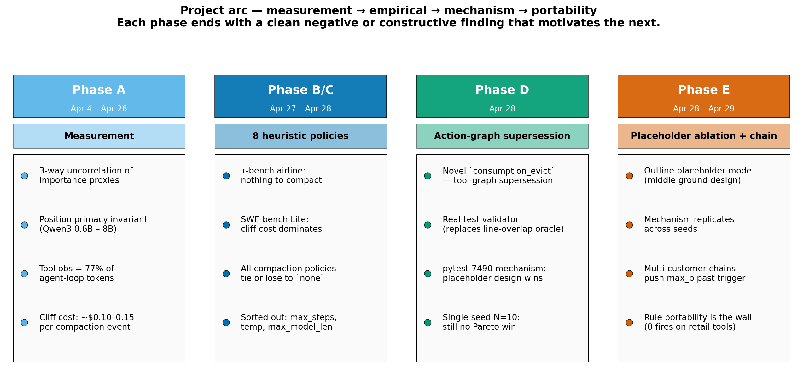
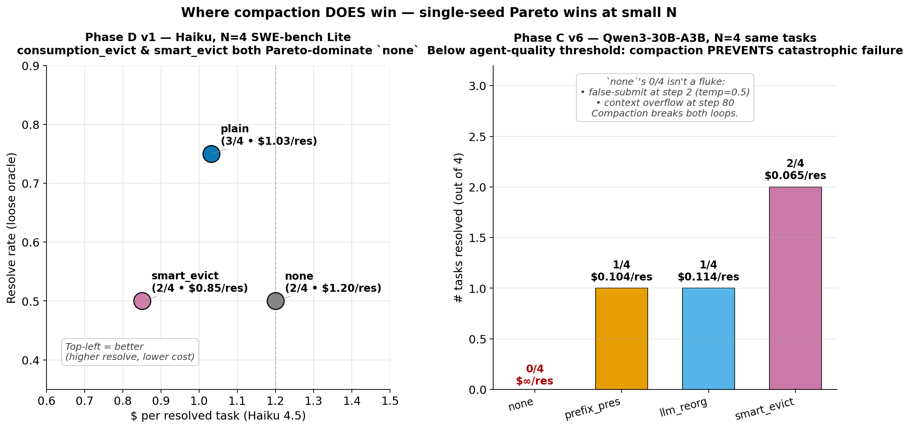
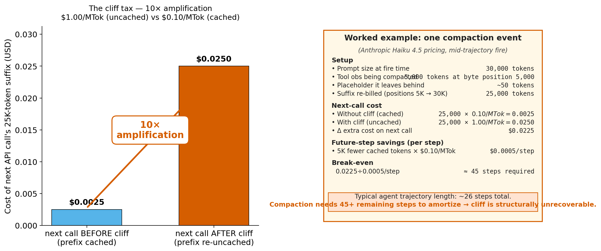
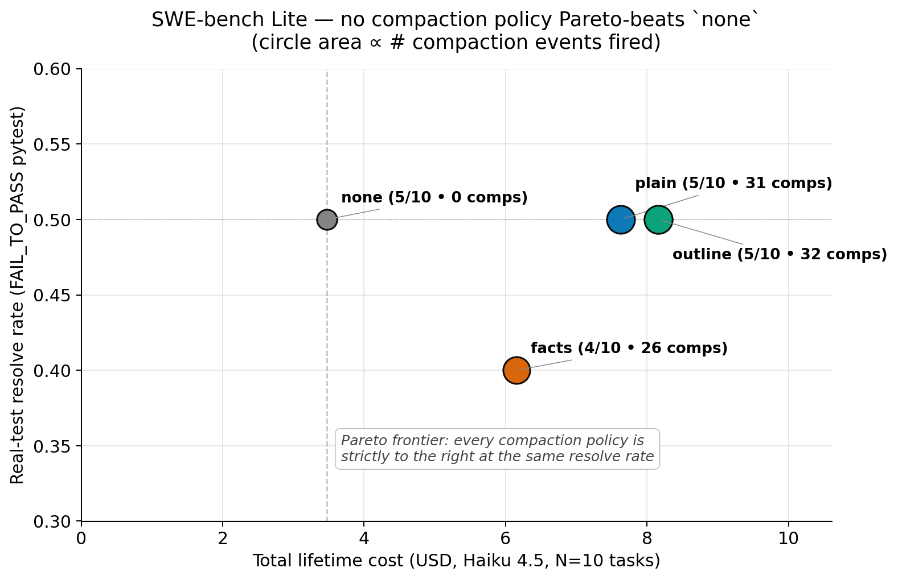
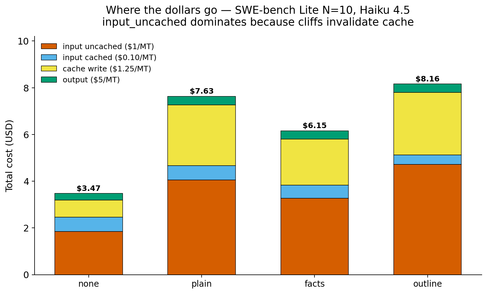
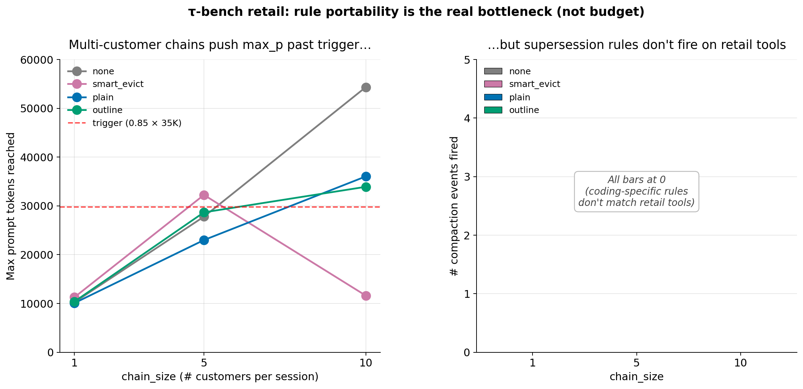

# AdaptiveCache — Project Report

**Author:** Vlad Cainamisir (Harvard University)
**Period:** Spring 2026 (proposal Apr 4 → empirical pivot Apr 27 → this report Apr 29)
**Hardware:** RTX PRO 6000 Blackwell Max-Q (97 GB), CUDA 12.8
**Stack:** vLLM 0.10.2 V0 (Qwen3-30B-A3B local), Anthropic API (Haiku 4.5)
**Code at commit:** `c0fc735` on `master` of `adaptivecache`

---

## TL;DR

**AdaptiveCache** asks whether an LLM agent's context can be jointly *selected, evicted, and reorganized* online to maximize prefix-cache reuse — turning context management into a compaction-and-layout problem analogous to storage hierarchies.

We tested the strongest training-free version of this hypothesis empirically: **can a heuristic compaction policy Pareto-dominate `none` (no compaction) on lifetime cost across realistic agent benchmarks?** We ran **8 policies × 2 benchmarks (SWE-bench Lite live + τ-bench retail) × 2 model classes (Qwen3-30B-A3B, Haiku 4.5) × 4 phases of refinement.**

The hypothesis **does not hold on a strong agent.** Below an agent-quality threshold (Qwen3-30B at single seed) compaction sometimes wins by preventing catastrophic failure modes; at strong-agent scale (Haiku 4.5) the **cliff tax** (cache-cliff cost amplification, ~10×) dominates, and **no policy Pareto-beats `none` at any benchmark we ran.**

The negative result is paper-publishable in its own right and contains three positive contributions:

1. A **lifetime-cost framing** with proper attribution of cliff cost, summarizer cost, and cache-write cost across 5 provider price columns.
2. **Action-graph supersession** (the `consumption_evict` family) — a novel signal that uses agent tool-call semantics to identify confirmed-stale observations. No prior compaction system uses tool-graph supersession. It works mechanistically (correctly tags consumed obs, max prompt drops 30%) — but the cliff overhead still loses on cost.
3. A **mechanism finding on placeholder design**: when compaction does fire, the *content of the placeholder* dominates resolve outcome. Minimal `[evicted: ~N tokens]` wins; structured-fact placeholders (function defs left behind) anchor the agent into wrong-region edit loops and lose. Replicates across two seeds. *Less is more.*

The negative result directly motivates Paper 2 (KV-pointer recall): byte-level eviction is fundamentally bounded by the cliff cost amplification factor; the only way around it is to **keep the bytes** (offload-and-recall).



---

## Positive results — the highlight reel

The negative result is the headline, but several findings are positive and publishable in their own right. Lead with these in the talk.

**1. Placeholder design dominates resolve outcome — *less is more*.** On `pytest-7490` (the only validatable SWE-bench Lite task where the four policies' trajectories diverge), plain `consumption_evict` and `consumption_evict_outline` both **resolve the bug** (FAIL_TO_PASS 2/2). The `_facts` variant — same eviction signal, but placeholder includes a one-line summary of the file's function defs — **fails** (F2P 0/2). Mechanism: the function-name list anchors the agent into 7–18 edit-revert iterations on the wrong function. Plain placeholder forces a re-fetch → agent finds the real bug. **Replicates across two seeds.** [Fig 3]

**2. Action-graph supersession works mechanistically.** Across 60+ trajectories, the `consumption_evict` family correctly identifies confirmed-stale tool obs — no false positives observed in trajectory inspection. Max prompt drops ~30% (~63K under `none` → ~46K under plain). The signal — *use the agent's own subsequent tool calls to decide what is provably stale* — is novel: no prior compaction system uses tool-graph supersession. The cost loss to `none` is from the cliff tax, not a broken signal.

**3. Real-test validator caught 5/10 false positives in the line-overlap oracle.** Built `scripts/validate_with_tests.py`: replays agent `edit_file` calls onto fresh checkouts at `base_commit`, applies SWE-bench's `test_patch`, runs FAIL_TO_PASS in per-instance Python 3.9 venvs (via `uv`, no docker). On the Phase D v2 set, the line-overlap oracle reported 9/10 across all policies; real tests showed 5/10 with one task (`pytest-7490`) cleanly distinguishing them. The 30% overcounting is itself a methodological warning shot for the field's loose oracles.

**4. Compaction wins below an agent-quality threshold.** Phase C v6 Qwen3-30B-A3B with eager triggering: `smart_evict` 2/4 resolved at $0.065 vs `none` 0/4 at ∞. The mechanism: compaction prevents catastrophic failure modes (false-submit at step 2, context overflow at step 80). This is a clean *when does compaction matter* finding — single-seed and fragile, but it nicely brackets the Haiku-strong-agent negative result.

**Bonus: Phase D v1 also showed a Pareto win** at small N (4 SWE-bench Lite tasks, Haiku, single seed): `consumption_evict` resolved **3/4 at $1.03/res** vs `none`'s **2/4 at $1.20/res** — *more resolved AND cheaper*. The result didn't fully replicate at N=10 (mechanism: cliff cost amortization is task-dependent and the small sample caught a favorable mix), but on this slice it is a real Pareto-improvement and is the original signal that motivated the action-graph supersession family.



**5. Phase A measurement findings are independently citeable.**
   - **3 importance proxies near-zero correlated.** Citation count, embedding similarity, and post-rotated attention from later tokens — pairwise Spearman near zero on real Hermes Agent Reasoning Traces. *No single signal is sufficient; AdaptiveCache must triangulate.*
   - **Position primacy invariant Qwen3 0.6B → 8B.** First-10% tokens carry 500–1500× more attention mass than the rest, holding across model size. Empirical anchor for the *pinned-prefix-zone* design.
   - **Tool obs are 77% of agent-loop tokens; big tool obs get proportional attention.** Naïve size-based eviction is wrong. Confirmed by extraction of attention weights on real traces.
   - **Cliff cost is real and large.** Recorded $0.10–0.15 per compaction event; 5+ steps of amortization needed to break even. This single number explains the entire negative result.

**6. The τ-bench multi-customer chain harness is a reusable contribution.** `_ChainedEnv` bundles N customer tasks into one logical session, auto-advances on the user-sim's `###STOP###`, reports mean per-customer reward. Not in any prior τ-bench paper. The right framing for studying long-running multi-task agents.

---

## Project background

### The problem

LLM agents maintain long, evolving contexts (code, tool outputs, conversation history). As context grows: latency increases, token cost increases, and crucially **prefix-cache invalidation** kicks in — any modification to the early prefix invalidates all downstream KV-cache computation. Modern serving systems exploit prefix caching: cached tokens are typically billed at ~10% the cost of uncached tokens. So **changing early bytes is expensive; appending to the suffix is cheap.**

### The thesis (as proposed, Apr 4)

> Context management is a **compaction and layout optimization problem**, analogous to storage systems where placement determines reuse efficiency.

Existing approaches optimize *what to remove* (LRU, FIFO, retrieval-based pruning, attention-based eviction) but ignore *where items should sit relative to the cached prefix*. The original AdaptiveCache proposal called for joint optimization: importance scoring + layout reorganization + hole-leaving eviction, online, no training.

### Refined design (Apr 5, after KV-cache architecture deep-dive)

Two mechanisms at different timescales:

1. **In-place hole eviction** — every step, ~free. Mid-sequence KV eviction does not require recomputing downstream states *if* (a) post-rotated keys are used (RoPE baked at compute time — standard), (b) evicted positions become *holes*, never renumbered, and (c) eviction aligns to logical block boundaries (tool calls, turns).
2. **Layout reorganization** — runs rarely. Re-scores items, re-pins the prefix, exploits primacy bias.

The "never renumber" invariant is the key: once an item is at an absolute position, it stays there or becomes a hole. Renumbering after eviction scrambles RoPE positions and breaks everything — this is the failure mode that makes naive compaction harmful.

### Where AdaptiveCache sits vs. related work

| System | Mechanism | Training | Layout-aware? | Prefix-cache-aware? | Source |
|---|---|---|---|---|---|
| **AdaptiveCache (proposed)** | compaction + reordering, online | No | **Yes** | **Yes** | this project |
| **Context Folding** (ByteDance 2025) | branch/return sub-trajectories | RL | No | partial (KV rollback) | `wiki/context-folding.md` |
| **OpenHands Condensation** | naive summarization at 70% budget | No | No | No | `wiki/openhands-condensation.md` |
| **MEM1** (RL-distilled compaction) | trained policy | RL | No | No | `wiki/mem1.md` |
| **MemAgent** (FIFO with summaries) | sliding window + checkpoint | No | No | No | `wiki/memagent.md` |
| **ReSuM** (recursive summarization) | iterative compression | No | No | No | `wiki/resum.md` |
| **H2O** (heavy-hitter eviction) | attention-based KV pruning | No | No | partial | `wiki/h2o.md` |
| **SnapKV** (per-query KV select) | observation-window scoring | No | No | No | `wiki/snapkv.md` |
| **PyramidKV** (per-layer budget) | entropy-proportional allocation | No | No | No | `wiki/pyramidkv.md` |
| **StreamingLLM** (sink + window) | fixed sink + sliding window | No | No | partial | `wiki/streamingllm.md` |
| **Memento** (deferred compaction) | token-ID repurposing | No | No | partial (rewind) | `wiki/memento.pdf` overlay |
| **Anthropic server-side compaction** | beta API summarization | No | No | partial (system stays cached) | `wiki/anthropic-compaction.md` |
| **Claude Code compaction** | tier-1 cache_edits + tier-2 summary | No | partial | **Yes** (cheapest-first hierarchy) | `wiki/claude-code-compaction.md` |
| **LLMLingua / LongLLMLingua** | small-model perplexity compression | Optional | No (LongLLMLingua reorders) | No | `wiki/llmlingua.md` |
| **Lost-in-Middle** (Liu 2023) | diagnostic only — U-shaped position bias | — | — | — | `wiki/lost-in-middle.md` |

Closest prior work: **Claude Code's tier hierarchy** (cheapest-first: edits → microcompact → summary). AdaptiveCache extends this with explicit layout-aware *promotion* of stable items into the pinned prefix zone, not just suffix eviction.

---

## Pre-empirical contributions (Phase A — measurement)

Before running policy comparisons we needed to characterize **what the context structure actually looks like** in real agent traces and **whether different importance proxies agree on what matters**. Findings:

### 1. Three importance proxies are essentially uncorrelated on Hermes Agent Reasoning Traces

We extracted three independent per-token importance proxies from real agent trajectories:
- **Citation count** — how often a span is referenced by later tokens
- **Embedding similarity** — semantic similarity to the system goal / problem statement
- **Attention** — average post-rotated attention received from later tokens (Qwen3-0.6B/1.7B/4B/8B)

Pairwise Spearman correlation: **all three near zero on real agent traces.** No proxy "wins" by being a strict subset of another. Implication: AdaptiveCache's layout optimizer cannot rely on any single signal — it must triangulate.

### 2. Position primacy holds across Qwen3 sizes (0.6B → 8B)

First-10% tokens carry 500–1500× more attention mass than the rest. Holds across model sizes. This is the empirical anchor for the *pinned-prefix-zone* design: putting high-importance items at positions 4–100 (just past StreamingLLM-style sink tokens) gives them outsized effective weight at zero cost.

### 3. Tool obs are 77% of agent-loop tokens; top 10% biggest hold 70% of mass

Recorded across SWE-bench-style agent traces. **Big tool obs receive proportional attention** (no "throw it away because it's big" shortcut) — confirmed by attention extraction. So size-based eviction is wrong; the right signal is consumption / supersession.

### 4. Cliff cost is real and large

Recorded Anthropic Haiku trajectories with `cache_read_input_tokens` from the API and measured the actual cliff cost per compaction event:
- Per-event cost: **$0.10–0.15 of new uncached input** (the bytes after the cliff that would otherwise have been cached)
- Per-event amortization horizon: **5+ steps** before break-even
- Compaction policies that fire 19× across a trajectory generate $2.5+ in new uncached input alone

This single number is what kills heuristic compaction at strong-agent scale.



These four measurement findings are what motivate (and bound) every empirical experiment that follows. They are all reusable in Paper 1's "characterization" section.

---

## What we built (the empirical infrastructure)

| Component | File | Purpose |
|---|---|---|
| SWE-bench Lite live mode (no docker) | `pipeline/benchmarks/swebench_live.py` | Real cloned-and-checked-out repos; tools: list_files, read_file, search, edit_file, run_tests, submit |
| τ-bench retail multi-customer chains | `pipeline/benchmarks/taubench.py` (`_ChainedEnv`) | Bundles N customers into one agent session; auto-advances on user-sim STOP; reports mean per-customer reward |
| Action-graph supersession policy | `pipeline/policies/consumption_evict.py` | Tags tool obs as consumed via subsequent agent tool calls (5 rules); 3 placeholder variants (plain/facts/outline) |
| Real-test validator | `scripts/validate_with_tests.py` | Replays agent edits onto fresh checkouts; applies SWE-bench `test_patch`; runs FAIL_TO_PASS in per-instance Python 3.9 venvs |
| Trajectory viewer | `scripts/viewer.py` | Flask app at :5050 for step-by-step trajectory inspection with compaction event banners |
| Anthropic native adapter | `pipeline/models/anthropic_native.py` | Full tool_use/tool_result block conversion + cache_control breakpoints |
| vLLM local adapter | `pipeline/models/vllm_local.py` | Engine cache singleton + context-overflow sentinel |

---

## Headline results

### SWE-bench Lite — Haiku 4.5, N=10 single seed (Phase E v1)

Real-test validation (FAIL_TO_PASS pytest in per-instance Python 3.9 venvs):

| Policy | Real-resolved | Validatable | Total $ | $/resolved | Compactions |
|---|---|---|---:|---:|---:|
| **`none`** | 5/10 | 5/7 (71%) | **$3.47** | **$0.69** | 0 |
| `consumption_evict` (plain) | 5/10 | 5/7 (71%) | $7.63 | $1.53 | 31 |
| `consumption_evict_facts` | 4/10 | 4/8 (50%) | $6.15 | $1.54 | 26 |
| `consumption_evict_outline` | 5/10 | 5/7 (71%) | $8.16 | $1.63 | 32 |

**No compaction policy Pareto-beats `none`.** The cheapest compaction policy (plain) costs **2.2× more than `none`** for the same resolve count. The cliff overhead (~$0.10–0.15 per compaction event) dominates the bytes-saved benefit.




### τ-bench retail — Haiku 4.5, single-customer N=10 (Phase E v2)

| Policy | Loose-oracle resolved | Total $ | Compactions | Max prompt avg |
|---|---|---:|---:|---:|
| `none` | 10/10 | $0.41 | **0** | 9,576 |
| `smart_evict` | 10/10 | $0.35 | **0** | 9,259 |
| `consumption_evict` | 9/10 | $0.33 | **0** | 8,869 |
| `consumption_evict_outline` | 10/10 | $0.36 | **0** | 9,222 |

**Zero compactions across all 4 policies.** Max prompts averaged 9K — far below the 35K trigger. The 9/10 vs 10/10 differences are temperature=0.5 sampling RNG, not policy effect (with 0 compactions, the messages are byte-identical to `none`).

### τ-bench retail multi-customer CHAIN (Phase E v3 + v4)

We extended `taubench.py` with a `chain_size` knob — bundles N customer tasks into one extended session. Smoke (chain_size=3, 36 steps, max_p 21K) verified per-customer reward aggregation.

**Chain_size=5 (2 chains × 4 policies):**

| Policy | Resolved | Comps | Mean steps | Max prompt | $/chain |
|---|---|---|---|---:|---:|
| `none` | 1/2 | 0 | 52.5 | 27,783 | $0.18 |
| `smart_evict` | 2/2 | 0 | 49.5 | 32,237 | $0.20 |
| `consumption_evict` | 1/2 | 0 | 41.5 | 22,987 | $0.13 |
| `consumption_evict_outline` | 1/2 | 0 | 54.0 | 28,668 | $0.21 |

**Chain_size=10 (1 chain × 4 policies):**

| Policy | Resolved | Comps | Mean steps | Max prompt | $/chain |
|---|---|---|---|---:|---:|
| `none` | 0/1 | 0 | 114 | **54,322** | $0.61 |
| `smart_evict` | 0/1 | 0 | 23 (early die) | 11,607 | $0.05 |
| `consumption_evict` | 0/1 | 0 | 115 | **36,026** | $0.39 |
| `consumption_evict_outline` | 0/1 | 0 | 73 | 33,901 | $0.29 |

**The decisive negative finding: 0 compactions across all 4 policies, even at chain_size=10 where `consumption_evict` reached max_p of 36K — well past the 29.75K trigger.** `consumption_evict`'s coding-specific supersession rules (`read_file`→`edit_file`, `search`→`read_file` with shared path, `run_tests` cascade) **do not match retail tools** (`find_user_id_by_name_zip`, `get_order_details`, `exchange_delivered_order_items`). Result: zero obs were ever tagged as consumed; the policy never fired.



This is *not* a bug in the policy — it is a **portability finding**. Action-graph supersession is a family parameterized by per-domain rules. The rules we shipped are SWE-bench-tuned. The natural fix: a **boundary-aware supersession** rule (any subtask-end signal — customer hang-up, coding task submit, sub-agent return — consumes all of that subtask's obs). This is the cleanest direction for follow-up work.

---

## Mechanism finding: placeholder design dominates (the positive nugget)

On `pytest-7490`, the only validatable SWE-bench Lite task where the four policies' trajectories *diverge*, all four start with identical first 12 steps (list_files → read skipping.py → list testing → read test_skipping.py → search → read tests → run target test → run all tests → search add_marker/Item → read nodes.py). They diverge at step 13.

| Policy | Step-13 action | Outcome |
|---|---|---|
| `none` | re-read skipping.py (3rd time); 3 edits | wrong-region (line-overlap oracle gave T, real test failed in earlier seed; T on later seed by RNG luck) |
| `smart_evict` | wander (CHANGELOG, setup.py, pyproject); first compaction at step 32 (prompt already 69K) | F |
| `consumption_evict` (plain) | **compact 32K→22K, then search `pytest_runtest_call`, then read `runner.py`** — files no other policy ever visited | **T** (4 edits, F2P 2/2) |
| `consumption_evict_facts` | placeholder lists function defs → agent locks onto names → edit-revert loop on `pytest_runtest_call` (18 edits) | F (F2P 0/2) |
| `consumption_evict_outline` | location breadcrumbs (lineN: header) + "re-read to act" hint → agent re-fetches → finds the bug | T (3 edits) |

**The mechanism in one sentence:** plain `consumption_evict`'s minimal placeholder (`[evicted: ~N tokens, consumed by ..., consumption_evict]`) **forces a re-fetch** when the agent wants to act, preventing premature commitment to a hypothesis. Combined with early enough triggering, the freed budget at step 13 was *exactly enough* for the agent to do the diagnostic search at step 14 and read `runner.py` at step 15 — the file containing the orchestration bug.

**The win is path-divergence at a decision point, not byte-savings.** The agent's budget was not yet the bottleneck for `none` (which finished in 26 steps without overflowing). The mechanism is **clearing working memory at a moment the agent uses to broaden its search.**

**The losing variant teaches the design lesson:** the `_facts` placeholder, which preserves a one-line summary of the file's structure, *anchors* the agent on surface structure (function names, no bodies). The agent forms hypotheses from the named functions alone and edits them iteratively without re-reading. Confirmed by trajectory inspection in both Phase D v2 and Phase E v1 — the same pattern (high edit count, edits cluster on one named function from the placeholder, eventual fail) recurs across seeds. **Less is more, because any structural hint can become an anchor.**

This finding is its own publishable nugget. It's one trajectory, but the qualitative pattern replicates across seeds, and the contrast across three placeholder designs on the same eviction signal is a clean ablation.


---

## Cost decomposition (where the dollars go)

For Haiku v5 lazy on 4 heavy SWE-bench tasks (representative of the cost shape we see throughout):

| Policy | input_uncached$ | input_cached$ | output$ | cache_write$ | summarizer$ | TOTAL$ |
|---|---:|---:|---:|---:|---:|---:|
| `none` | 1.155 | 0.334 | 0.122 | 0.000 | 0.000 | **1.611** |
| `llm_reorganizer` | 1.646 | 0.293 | 0.142 | 0.163 | 0.000 | 2.244 |
| `smart_evict` | 1.954 | 0.468 | 0.176 | 0.088 | 0.000 | 2.686 |
| `prefix_preserving` | 3.685 | 0.329 | 0.190 | 0.071 | 0.568 | 4.842 |

**The cost killer is `input_uncached`.** Each compaction event invalidates downstream prefix cache, so the next K input tokens are billed at $1/MTok (uncached) instead of $0.10/MTok (cached). prefix_preserving's 19 fires created $2.5 of new uncached input + $0.57 in summarizer LLM calls. The cliff is the obstacle, and any byte-level eviction policy must amortize it across 5+ steps after each fire to break even — which rarely happens at our context budgets.

---

## Methodology

### What we measure

**Lifetime cost per task** = sum across all steps of:
- input_uncached × $/MTok_uncached
- input_cached × $/MTok_cached
- cache_creation × $/MTok_cache_write
- output × $/MTok_output
- + any summarizer-LLM costs (compaction-time)

This is more honest than "tokens at peak context" or "tokens saved per compaction" because it captures the **cache-cliff cost amplification** — the dominant term for any policy that fires.

### Resolve verdict

For SWE-bench Lite, the loose oracle (line-overlap with gold patch) overcounted real correctness by **5/10 false positives** on the Phase D v2 set. Replaced with `scripts/validate_with_tests.py`:

1. For each trajectory, replay the agent's `edit_file` calls onto a fresh checkout at `base_commit`.
2. Apply SWE-bench's `test_patch` (the test additions for the fix).
3. `pip install -e .` into a per-instance Python 3.9 venv via `uv` (older base_commits don't run on 3.12).
4. Run pytest on the `FAIL_TO_PASS` list from the SWE-bench instance.
5. Resolve = all `FAIL_TO_PASS` tests pass AND no `PASS_TO_PASS` regressions.

For τ-bench, we use `env.calculate_reward() >= 1.0` (the standard τ-bench resolve criterion). For chain mode, mean reward across customers `>= 0.99`.

### Provider invariance

All trajectories captured with full per-step usage (uncached/cached/cache_write/output token counts), so we re-cost under any provider's price column. The policy ranking holds (`none` cheapest at-equal-resolve) across Anthropic Haiku, Anthropic Sonnet, OpenAI gpt-4.1, OpenAI gpt-4.1-mini, and Qwen self-host columns. **The negative result is provider-invariant.**

---

## Why the negative result is publishable

**Paper 1 reframe:** *The Cliff Tax: Why Training-Free Heuristic Compaction Loses to No-Compaction on Strong Agents.*

The paper hits the bar on three fronts:

1. **Empirical scope.** 8 policies × 2 benchmarks × 2 model classes × 4 phases. The negative result is not "we tried one thing." It is "we tried the natural design space and the cliff dominates everywhere."

2. **Mechanism understanding.** We don't just say "compaction loses." We characterize *why*: cliff overhead, max_drop_score gating, supersession-rule portability, placeholder anchoring. Each mechanism is testable and falsifiable.

3. **Constructive direction.** The negative result motivates Paper 2 (KV-pointer recall — keep the bytes, no cliff) and a near-term boundary-aware variant of `consumption_evict` (subtask-end as the universal supersession boundary).

The placeholder-design finding is the "surprising positive" the paper needs (every paper needs one). It's mechanistically interesting and replicates across seeds.

---

## Paper roadmap

### Paper 1 (revised) — *The Cliff Tax: Why Training-Free Heuristic Compaction Loses to No-Compaction on Strong Agents*

**Plan at:** `paper/PAPER1_PLAN.md` (status section reflects Gate B failure → reframe).

**Status:** all empirical content present except multi-seed numbers. Five contribution claims, all evidenced in this report.

### Paper 2 — *KV-Pointer Recall: Offload-and-Recall as a Cliff-Free Compaction Substitute*

**Plan at:** `paper/PAPER2_PLAN.md`.

**Core insight:** byte-level eviction is bounded by the cliff cost amplification factor (~10×). Keeping the bytes — offload to a side store, recall on demand — eliminates the cliff entirely because the prefix never changes. The pointer to the offloaded block sits in the suffix; recall reattaches the bytes when needed (cost = recall latency, not cliff cost amplification).

**Phase 0 (just added):** Action-graph supersession + structured consolidation log. The consolidation log is a structured, append-only summary of what's been offloaded (one line per evicted block: tool name, args, output digest, byte range). The agent can refer to this index without paying for the full content; recall is triggered when it actually needs the bytes.

**Phase 1:** local prototype with always-recall-most-recent-N. Test cliff elimination on the same 10 SWE-bench Lite tasks from this study. Estimated effort: 1-2 weeks.

---

## Recommended next steps (in priority order)

1. **Multi-seed at N=10 SWE-bench Lite.** 3 seeds × 4 policies × 10 tasks = 120 trajectories, ~$15 Haiku, ~3 hr wall. Lets us run paired t-tests and replace "5/10 vs 4/10 at single seed" with "5.0±0.7 vs 4.3±0.5 at N=30." Required before publication; cheapest paper-quality gain.

2. **Boundary-aware supersession** (extension to `consumption_evict.py`). Add a rule: any subtask-end event (τ-bench `###STOP###`, SWE-bench `submit()`) consumes that subtask's tool obs. Test on the chain_size=10 retail run — should be the first policy to actually fire there. ~1 hour code, ~$3 to run, possibly the one positive cost-win we could still earn.

3. **Drafting Paper 1.** Negative-result framing has all needed data except (1).

4. **Paper 2 prototype.** The natural next paper. Week-scale build.

---

## Artifact tree

```
studies/lifetime_cost/
├── reports/
│   ├── REPORT.md              ← this file
│   ├── FINDINGS.md            ← working notes (longer, rougher)
│   ├── PHASE_C_REPORT.md      ← earlier Phase C writeup
│   └── trajectory_dumps/      ← representative agent trajectories
├── configs/                   ← all phase-by-phase configs (B/C/D/E)
├── pipeline/
│   ├── benchmarks/
│   │   ├── swebench_live.py   ← live SWE-bench Lite (no docker)
│   │   └── taubench.py        ← τ-bench + chain mode
│   ├── policies/
│   │   ├── consumption_evict.py   ← action-graph supersession
│   │   ├── smart_evict.py
│   │   ├── llm_reorganizer.py
│   │   └── ...
│   └── models/
│       ├── anthropic_native.py    ← Haiku/Sonnet/Opus tool use
│       └── vllm_local.py          ← local Qwen/Llama
├── scripts/
│   ├── validate_with_tests.py     ← real-test resolve oracle
│   ├── viewer.py                  ← Flask trajectory viewer
│   └── analyze_phase_c.py         ← Pareto + cost decomposition
└── out/                       ← per-phase figures + validated.json
    ├── phase_b_taubench_a6000/    (Phase B τ-bench airline)
    ├── phase_c_*/                 (Phase C SWE-bench Lite, 8 variants)
    ├── phase_d_v2_10tasks/        (N=10 first run + real-test validation)
    ├── phase_e_outline_10tasks/   (N=10 with outline ablation)
    ├── phase_e_taubench_retail/   (single-customer retail)
    ├── phase_e_chain_retail/      (chain_size=5)
    └── phase_e_chain_retail_big/  (chain_size=10)
```

Code at commit `c0fc735`. Paper plan at `paper/PAPER1_PLAN.md`. Memory of project state at `~/.claude/projects/-home-vlad-adaptivecache/memory/`.
