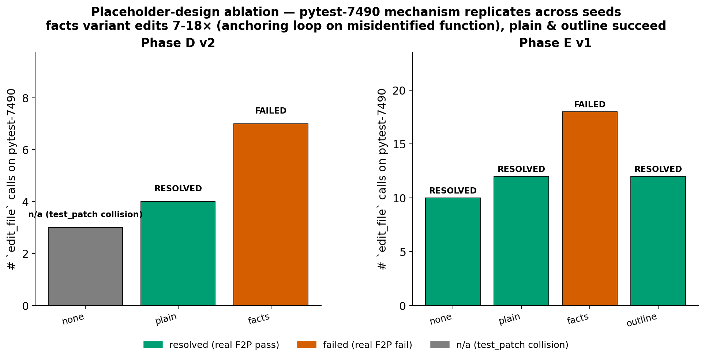

# 5-minute talk — for an audience new to the area

**One finding, told as a story. No jargon.**

---

## Slide 1 — The hook (0:00 → 0:40)

**Visual:** title slide. *"I gave four AI agents the same bug to fix. The one that succeeded was the one I told the least."*

**Say:**

> AI assistants like ChatGPT can do more than chat — they can **act**. They read files, run tests, edit code, all in a loop. We call that an *agent*. Agents are powerful, but they have a memory problem: every step they take is added to a growing record, and every step gets more expensive than the last because the AI has to re-read everything it's done.
>
> The natural fix is what humans do: **drop old stuff you don't need anymore.** That's what this project is about. And along the way, we found something surprising — a small design choice nobody talks about can decide whether the AI succeeds or fails. That's the story I want to tell you.

---

## Slide 2 — The setup (0:40 → 1:30)

**Visual:** simple cartoon — an agent's "memory" filling up with file reads and search results.

**Say:**

> Imagine an AI debugging a piece of software. It opens a file. Reads a hundred lines. Searches for a function. Runs a test. By step thirty, the AI's *memory* is full of old file contents that don't matter anymore — it already moved on. So we'd like to clear those out.
>
> Here's the trick. When you remove something from the AI's memory, you can leave a **note** behind, like a Post-it that says *"I read this file already."* That note tells the AI "I've seen this; don't go look again." So the question is: **what should the note say?**
>
> Should it just say "I read this file"? Or should it summarize what was in the file? Logically, more information is better, right? The AI will know what's in the file without going back. We tested that.

---

## Slide 3 — The experiment (1:30 → 2:50)

**Visual:** `fig3_placeholder_ablation.png`

**Say:**

> We took one tricky bug — a real bug from a real Python testing library — and ran the AI on it four times, changing only one thing: **what the Post-it said.**
>
> Version one: **plain Post-it.** "I read this file." Nothing else.
>
> Version two: **detailed Post-it.** "I read this file. It contained these five functions: setup, configure, runtest, makereport, evaluate."
>
> Both designs are reasonable. The detailed one preserves more information, costs almost nothing extra. You'd expect it to do better.
>
> What you're looking at is the result, replicated across two runs. The **green bars** are when the AI fixed the bug. The **orange bar** is when it failed. The **detailed Post-it lost both times** — and not by a little. The AI tried to fix the bug **eighteen times in a row** on the same wrong function. The plain Post-it succeeded in **four edits.**

---

## Slide 4 — Why this happens (2:50 → 3:50)

**Visual:** keep fig3 on the slide, with one sentence overlay: *"More information in the note → AI commits to the wrong hypothesis."*

**Say:**

> Why would more information make things worse? Here's the mechanism.
>
> When the AI sees the detailed note — a list of function names — it picks one of those names and starts editing. The list looks like enough information to act on. But function names without bodies are misleading. The AI assumes which function is buggy and edits it. The test fails. It tries another edit. Fails again. **It never goes back to read the actual file** because the note seemed sufficient.
>
> The plain note, by contrast, *forces* the AI to go re-read the file. And when it does, it sees something it missed the first time, which leads it to a different file entirely — the file that actually contains the bug.
>
> The lesson: **a confident-looking summary anchors the agent on surface details.** An empty hint forces a fresh look. **Less is more — because any structural hint can become an anchor.**

---

## Slide 5 — Why it matters (3:50 → 5:00)

**Visual:** one sentence on a clean slide: *"The note's design decides whether the AI is smart or stuck."*

**Say:**

> This sounds like a small finding about a Post-it note, but it's a real design lesson for anyone building AI agents — and a lot of people are.
>
> First: counter-intuitively, **giving an AI more context can hurt it.** It's not always about adding signal; sometimes you need to leave the AI room to update its own understanding.
>
> Second, this connects to a bigger question my project cares about: **can we make long-running AI agents cheaper without making them dumber?** The Post-it experiment is one slice of that. The full project tested eight different memory-management strategies; on strong AI agents none of them clearly beat doing nothing — because the cost of *changing* the AI's memory turns out to be larger than the savings.
>
> So we have a constructive negative result, plus this one sharp positive: when you do compress, what you leave behind matters more than what you remove. Thank you.

---

## Pacing target

| Slide | Time | Words |
|---|---|---:|
| 1 — Hook | 40s | ~110 |
| 2 — Setup | 50s | ~140 |
| 3 — Experiment | 80s | ~160 |
| 4 — Mechanism | 60s | ~145 |
| 5 — Why it matters | 70s | ~160 |
| **Total** | **5:00** | **~715** |

## If running short

Cut Slide 5's first paragraph — go straight from the lesson to "this is part of a bigger project on making long-running AI cheaper" + "thank you."
